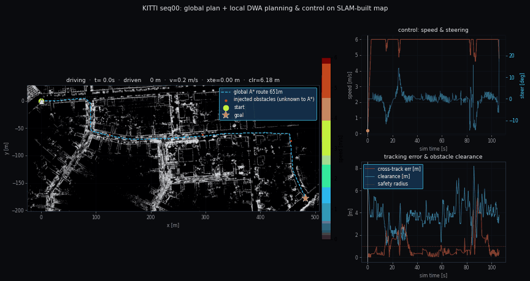
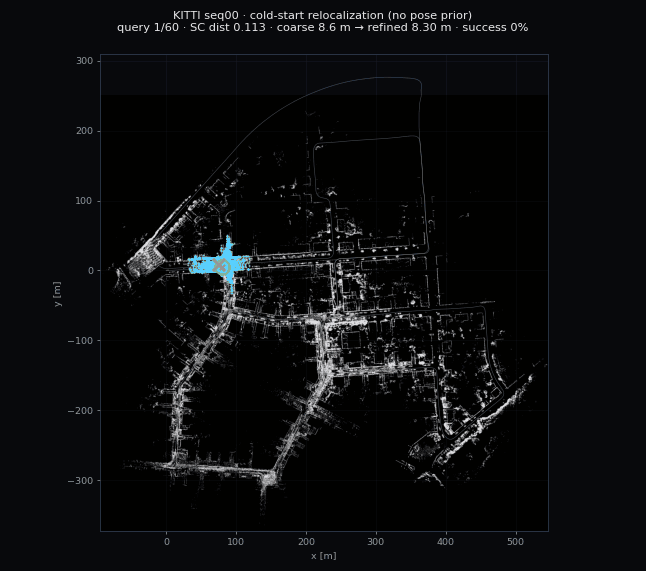
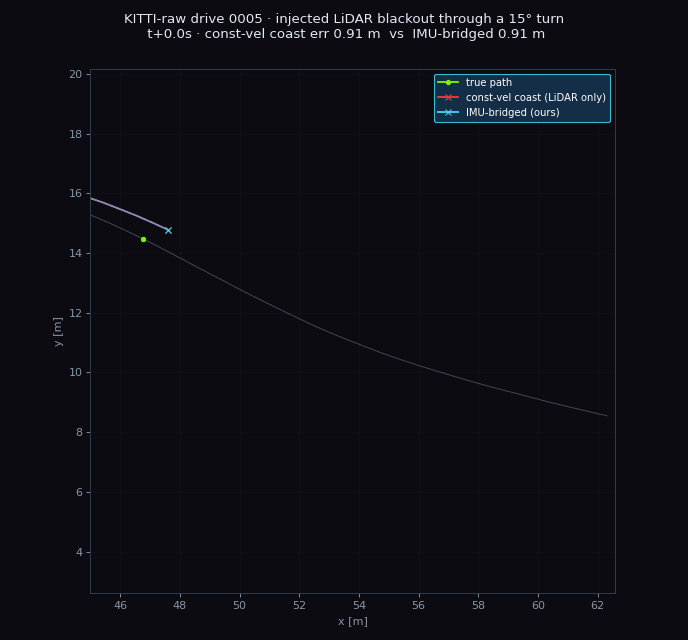
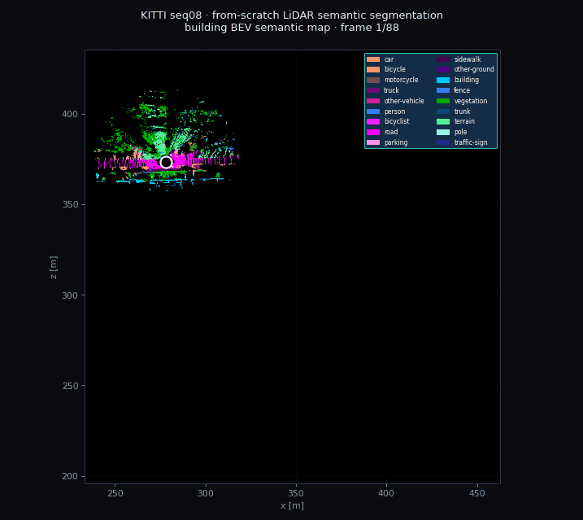
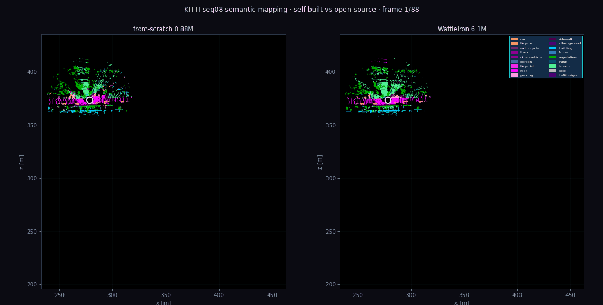
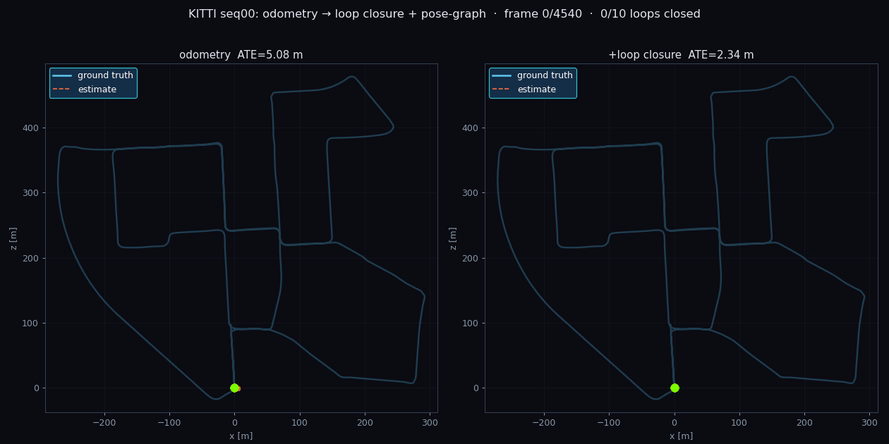
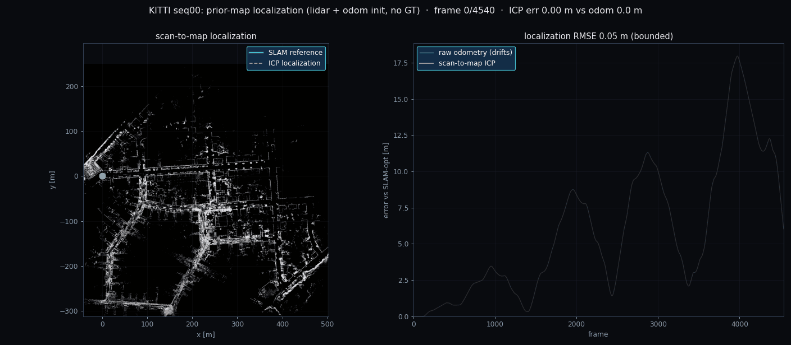
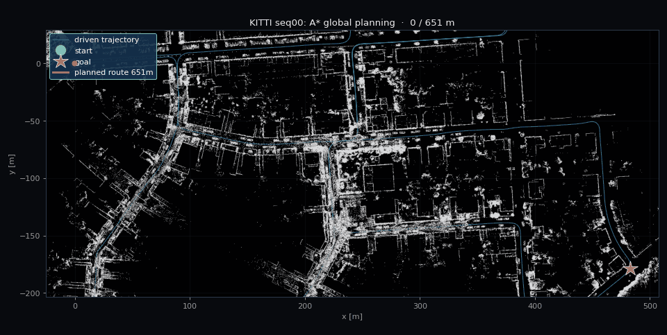
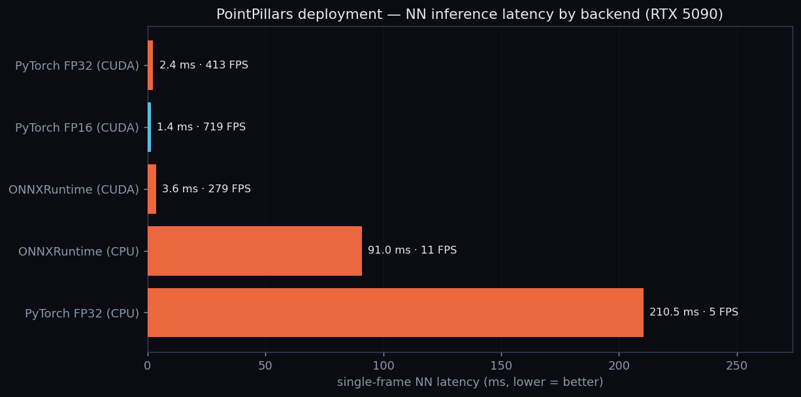
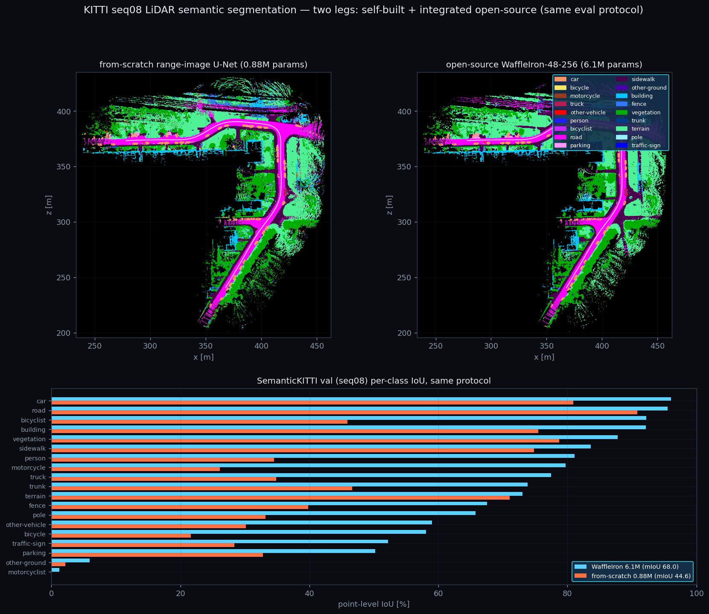

# 🛰️ 大场景 LiDAR SLAM · 定位 · 导航 · 感知

[](https://github.com/AYANE225/VGGT-Lidar-SLAM/actions/workflows/ci.yml)


> 数公里真实城区（KITTI）上，从零手写的一整条自动驾驶感知-定位栈：一帧激光进来 → 稳定轨迹与地图、
> 厘米级定位、全局路径，再叠神经网络检测 / 跟踪 / 去动态。**纯 LiDAR、离线可复现、每块自研**，
> 只借 `numpy / scipy / open3d`，不碰任何非公开研究代码。

### ✨ 一眼亮点

| | |
| --- | --- |
| 🗺️ **完整栈自研** | 里程计 → 回环 → 位姿图 → 建图 → 定位 → 导航，端到端跑通 |
| 🎯 **SLAM 精度接近经典 LOAM** | 六序列平移误差均值 **0.82%**；seq00 回环后 ATE **4.85 → 2.25 m** |
| 🔄 **外观级回环抗漂移** | 自写 Scan Context：漂移下召回持平 **0.51**（位置法从 0.96 塌到 **0**），ATE **5.08 → 1.77 m** |
| 📍 **定位误差有界 5 cm** | 先验图 scan-to-map ICP，同段里程计已漂 7.7 m |
| 🔦 **无初值全局重定位** | 被"绑架"到地图未知处：Scan Context 外观检索→scan-to-map ICP，seq00 冷启动 **98%** 成功、中位 **0.04 m**（无检索盲配 **0%**） |
| 🧭 **真 IMU 惯性桥接** | KITTI-raw OXTS 真惯导 + 从零预积分：LiDAR 盲区过弯，匀速外推漂 **3.41 m** → 惯导桥接 **1.10 m**（**3.1×**） |
| 🎨 **LiDAR 语义分割 · 自研＋集成开源** | 从零距离图 U-Net（**0.88 M**）val **mIoU 44.6**；再**同口径**接入开源 WaffleIron（**6.1 M**）复现 **68.0**，并排 BEV 语义地图诚实对照 |
| 🕹️ **闭环导航真开出去** | 全局 A* → 运动学自行车 + DWA 局部规划/控制把车开到终点：seq00 **651 m REACHED**、横向误差 **0.95 m**、反应式绕开 3 处全局图未知障碍 |
| 🚗 **从零手写 PointPillars** | 不碰 spconv/OpenPCDet，KITTI val Car BEV **AP@0.7 = 70.06** |
| ⚙️ **模型落地部署** | 折叠 BN 导出 ONNX（**数值对齐 2e-5**）+ 多后端时延对比：FP16 **1.74×**、Blackwell ORT-CUDA 跑通 |
| ⚡ **从零 C++/Eigen ICP** | pybind11 + OpenMP，比 NumPy 快 **~8×**，与 Open3D 差 **0.1 mm** |
| 🔁 **感知反哺 SLAM** | 多目标跟踪判动/静 → 剔除动态点 → 干净静态地图 |
| 🌈 **VGGT 深度耦合** | 因子级→点级→联合 BA；里程计中断 ATE **11.18→0.51 m**、LiDAR 盲区误差稳在 **0.11 m** |
| 🤖 **ROS2 在线化** | 自研栈封装成实时节点图，回放驱动 + RViz2 + `ros2 bag` |
| 🛰️ **跨传感器泛化** | KITTI 栈**零改动**跑 nuScenes（HDL-32E，32 线），10 场景 ATE 均值 **0.34 m** |
| ✅ **工程化** | 48 项单测 + GitHub Actions CI（含 C++ 扩展自动编译） |

---

## 🎬 效果一览

**实时演示（seq00）**：左固定全景边跑边建图，右跟车视角激光 + 手写 PointPillars 检测框 + 静/动航迹。


**五层金字塔**：① 轨迹 / ② 动态物体 / ③ 激光点云 / ④ LiDAR 稠密图 / ⑤ VGGT×LiDAR 稠密重建。


**▶ 在线打开：<https://ayane225.github.io/VGGT-Lidar-SLAM/pyramid_seq00.html>**（GitHub Pages）


</details>

**闭环导航（seq00）**：全局 A* 规一条 651 m 路，再用运动学自行车模型 + DWA 局部规划/控制**真把车开到终点**——沿途反应式绕开 3 处全局图未知的临时障碍，诚实报横向误差 / 余隙 / 是否到达（右侧控制曲线随仿真时刻同步扫过）。


**🆕 定位 · 感知三连**：无初值全局重定位 · 真 IMU 惯性桥接 · 从零 LiDAR 语义分割（详见下方[亮点拆解](#-亮点拆解)）。

**① 无初值全局重定位（seq00）**：车被"绑架"到先验地图未知处，仅凭一帧激光找回 6DOF 世界位姿——Scan Context 外观检索给粗位姿、scan-to-map ICP 精化到亚分米。冷启动 **98%** 成功、中位 **0.04 m**，"无 place recognition 盲配"对照 **0%**。


**② 真 IMU 惯性桥接 LiDAR 盲区（KITTI-raw drive_0005）**：注入一段 LiDAR 盲区，纯激光只能靠匀速先验外推、过弯直冲出去；KITTI 真惯导（OXTS）驱动**从零 IMU 预积分**把位姿稳稳桥过转弯——2.5 s 盲区末端误差 **3.41 m → 1.10 m**。


**③ 从零 LiDAR 语义分割 → 累积 BEV 语义地图（seq08）**：距离图 U-Net 逐点分类（道路/人行道/建筑/植被/车…按 SemanticKITTI 官方配色），按位姿累积生长出一张语义地图。**val mIoU 44.6**。


**🆕 两条腿 · 自研 vs 集成主流开源（seq08 同口径）**：同一段城区、同一点级评测协议，把从零的 **0.88 M** 距离图网与集成的开源 **WaffleIron-48-256（6.1 M）** 并排——左自研、右开源，诚实报差距。全量 val 逐点 **mIoU 44.6 vs 68.0**，开源大模型在小目标/稀有类（自行车 22→58、摩托 26→80、行人 35→81、杆 33→66）优势明显；既展示**从零自研**，也展示**接入主流开源生态**的工程能力（详见下方[亮点拆解](#-亮点拆解)）。


| | |
| --- | --- |
| 回环前后 vs 真值  | 六序列泛化  |
| 城区占据地图  | 俯视激光点云  |
| 先验图定位（误差有界） | 全局路径规划  |
| PointPillars 预测（绿）vs 真值（红） | 动态感知建图  |
| 外观级回环抗漂移（Scan Context） | VGGT 稠密重建融进 SLAM  |
| 相机 RGB 真彩 LiDAR 地图  | VGGT 因子接回中断轨迹  |
| 点级联合 BA（盲区误差稳在 0.11 m） | VGGT 点补进 ICP（越稀增益越大） |

**部署时延**：折叠 BN 导出 ONNX，单帧 NN 推理多后端对比（RTX 5090 / Blackwell sm_120）。


---

## 🧩 全栈流水线

一帧激光扫描依次流过五个自研模块（seq00，4541 帧 / 3.7 km）：

| 阶段 | 做法 | 结果 |
| --- | --- | --- |
| ① 里程计 | scan-to-local-map 点面 ICP + 匀速先验 | 前 200 帧 ATE **0.22 m**、~30 ms/帧 |
| ② 回环 + 后端 | 近邻 / 外观检测 → ICP 收伪 → 位姿图优化 | 全程 ATE **4.85 → 2.25 m** |
| ③ 建图 | 3D 体素图 + 2D 占据栅格 | 310 万点，~600×600 m |
| ④ 定位 | 先验图 scan-to-map ICP | RMSE **0.05 m（有界）** |
| ⑤ 导航 | 占据图全局 A*（膨胀 + 可行驶走廊） | 起点→最远点 **650 m** |
| ⑥ 闭环控制 | 运动学自行车模型 + pure-pursuit + DWA 局部避障 | 651 m 全程 **REACHED**、横向误差 **0.95 m** |

**感知层**：手写 PointPillars 检测 → 卡尔曼多目标跟踪判动/静 → 剔除动态点得干净静态图。

---

## 🔬 亮点拆解

> 涉及 VGGT 的部分只调**公开模型 + 官方冻结权重**，融合 / 耦合逻辑全自研，绝不碰非公开研究代码。

### 🔄 外观级回环 · Scan Context（`kitti_slam/scan_context.py`）

自写极坐标最大高度指纹 + 旋转不变环键 + 列移不变距离。**按外观匹配、与里程计无关**：漂移时位置法漏检，它不受影响；SC 相对偏航还能当 ICP 验证初值（漂移下里程计初值把点云推到几公里外 fit=0，SC 偏航初值稳稳 fit=1.00）。

| 前端 | r=20m | r=10m | r=5m | r=2m | **Scan Context** |
| --- | --- | --- | --- | --- | --- |
| 召回 | 0.96 | 0.78 | 0.32 | **0.00** | **0.51（平线，precision 1.00）** |

端到端 ATE：里程计 **5.08 → 1.77 m**，优于位置法回环的 2.34 m。

### 🕹️ 闭环导航 · 局部规划 + 控制（`kitti_slam/control.py`）

全局 A* 只给一条几何路径；这里把它**真正开出去**：运动学自行车模型前向仿真，每步 pure-pursuit 定跟踪转向、DWA 在转向扇里 rollout 拒碰撞选最优，纵向按**转弯限速 + 到障碍的刹车距离**平滑调速（提前减速而非冲上去急刹）。驶过的 SLAM 轨迹当作已知可行走廊，再注入若干全局图未知的临时障碍演示反应式绕行——全离线、复用现有占据图、不依赖任何外部规划/控制库。

| seq00（651 m 全局路线 · 注入 3 处临时障碍） | 结果 |
| --- | --- |
| 是否到达 | **REACHED**（实际行驶 623 m / 106 s 仿真） |
| 横向跟踪误差 | 均值 **0.95 m**（急弯峰值 5.3 m：车像真车一样切过栅格路的 90° 直角） |
| 最小余隙 | **1.08 m**（> 安全半径 1.0 m，全程未碰撞） |
| 临时障碍 | 反应式绕开 **3/3**（全局规划器未知） |

### 🔦 无初值全局重定位 · kidnapped robot（`kitti_slam/relocalize.py`）

常规先验图定位要给初值；这里**去掉初值**：车被"绑架"到已建地图上的未知处，仅凭一帧激光找回 6DOF 世界位姿。Scan Context 按**外观**检索最相似的建图关键帧（+相对偏航）作粗位姿，scan-to-map ICP 精化到亚分米。对照组"无 place recognition"只从地图中心盲配——凸显外观检索对全局重定位的必要性。

| seq00 · 先验图 310 万点 · 90 个随机查询帧（无初值） | 结果 |
| --- | --- |
| SC 外观检索 → scan-to-map ICP 成功率（终误差 < 2 m） | **98%** |
| 成功帧位置误差中位 | **0.04 m** |
| 对照：无 place recognition · 地图中心盲配 ICP | **0%** |

### 🧭 真 IMU 惯性桥接 · 从零预积分（`kitti_slam/imu.py` · `kitti_raw_io.py`）

KITTI-raw OXTS 真惯导（RT3003，10 Hz）驱动**从零捷联预积分**：陀螺经 SO(3) 指数映射累积姿态、加计（含重力、车体系）转世界系扣重力后欧拉积分。演示注入一段 2.5 s LiDAR 盲区（城区过弯 drive_0005）：纯激光只能靠匀速先验外推、过弯直冲出栅格路；IMU 从盲区入口的激光速度/姿态起积，稳稳桥过转弯。**干净段两者持平、主传感器失效时惯导补位**（同项目 VGGT-dropout 的诚实范式）。

| KITTI-raw drive_0005（城区过弯 · 注入 2.5 s LiDAR 盲区） | 盲区末端位置误差 |
| --- | --- |
| 健康段 LiDAR 里程计 ATE | 0.84 m |
| 匀速先验外推（纯 LiDAR 盲区） | **3.41 m** |
| 真 IMU 预积分桥接 | **1.10 m（3.1×）** |

### 🚗 手写 PointPillars 3D 检测（`det3d/`，纯 PyTorch）

不碰 spconv/OpenPCDet：点云切 pillar → 骨干 → 锚框头 → focal 损失 → 旋转框 IoU 分配 / NMS 全手写（4.81 M 参数）。走纯 2D 卷积，也免去在 5090 上编译 spconv 的麻烦。
> **KITTI val Car BEV AP（R40）：AP@0.5 = 80.46，AP@0.7 = 70.06。**

### ⚙️ PointPillars 落地部署（`det3d/deploy.py`）

把训好的检测器搬上推理引擎：**折叠 BN**（Conv/Linear+BN 解析并进权重）后导出端到端 ONNX（动态柱数 P），喂 ONNXRuntime。导出**数值对齐**（torch vs ORT 最大绝对差 **2e-5**）——故 AP 不受影响，400 val 帧经 ORT-CUDA 重算 AP@0.7 **71.76**（与原栈同档，差异来自帧子集而非导出）。

| 后端（RTX 5090 / Blackwell sm_120） | 单帧 NN | FPS | 加速 |
| --- | --- | --- | --- |
| PyTorch FP32 (CUDA) | 2.42 ms | 413 | 1.00× |
| **PyTorch FP16 (CUDA)** | **1.39 ms** | **719** | **1.74×** |
| ONNXRuntime (CUDA) | 3.58 ms | 279 | 0.68× |
| ONNXRuntime (CPU) | 91 ms | 11 | 可移植 |

> sm_120 上先折叠 BN 才让 ORT-CUDA 跑通（绕开 cuDNN BatchNorm 内核限制）；TensorRT EP 已接入（`trt_fp16_enable`），本机缺 `libnvinfer`，自动跳过并如实标注。

### 🎨 LiDAR 语义分割 · 两条腿：从零自研 ＋ 集成主流开源（`semseg/`，纯 PyTorch）

**第一条腿 · 从零自研（`semseg/model.py`）**：不借任何分割库——点云球面投影成 64×1024 五通道距离图 → 带跳连的 2D U-Net（**0.88 M** 参数）→ 逐像素 19 类 → 反投影回点得逐点标签。SemanticKITTI 官方 learning_map、10 序列训 / val seq08，加权 CE（逆频）+ OneCycle + AMP。逐帧点级预测按位姿累积生长出 BEV 语义地图。

**第二条腿 · 集成开源（`semseg/opensource.py`）**：接入主流开源 **WaffleIron**（valeoai, ICCV'23）——纯 PyTorch（无 spconv / torchsparse，故能直接在 Blackwell sm_120 / RTX 5090 上推理），载官方 KITTI 预训练权重（WaffleIron-48-256, **6.1 M**），复用其体素化 / 三平面投影 / 邻域预处理出逐点 19 类。类序与自研完全一致、预测按原始点序对齐，可**同口径**直接对照。薄适配层只做加载与推理编排，不改第三方源码；第三方代码与权重不入库（见 `.gitignore`，用法见 `semseg/opensource.py`）。

同一份 seq08 val、同一点级 mIoU 协议（忽略 unlabeled），**4071 帧全量**对照：

| SemanticKITTI val (seq08) · 逐点 IoU | 自研 0.88 M | 开源 WaffleIron 6.1 M |
| --- | --- | --- |
| **mIoU** | **44.6** | **68.0** |
| car / road / building | 80.9 / 90.8 / 75.5 | 96.1 / 95.5 / 92.1 |
| vegetation / sidewalk / terrain | 78.7 / 74.8 / 71.0 | 87.8 / 83.6 / 73.0 |
| bicycle / motorcycle / person | 21.6 / 26.1 / 34.5 | 58.1 / 79.7 / 81.1 |
| pole / traffic-sign / trunk | 33.2 / 28.3 / 46.6 | 65.7 / 52.2 / 73.8 |

差距诚实：开源大模型在**小目标 / 稀有类**（自行车、摩托、行人、杆、交通牌）上领先最多；自研轻量网在**大面积类**（车 / 路 / 植被）已相当接近。这一节既展示**从零手写**的能力，也展示**结合主流开源项目**的工程集成能力。



### ⚡ C++/Eigen 点面 ICP（`native/`，pybind11 + OpenMP）

Eigen 6-DOF 高斯牛顿 + nanoflann KD 树 + OpenMP，暴露成 `kitti_slam.icp_cpp`：

| 后端 | 耗时/帧 | 与 Open3D 位姿差 |
| --- | --- | --- |
| **自研 C++/Eigen** | **12.3 ms** | **0.1 mm** |
| 等价 NumPy | 101.5 ms | 0.1 mm |
| Open3D | 4.6 ms | (ref) |

### 🌈 VGGT 深度耦合（三步，逐步下沉到点级）

前馈视觉几何大模型 VGGT 的稠密重建融进 LiDAR SLAM。三步共同结论：**干净数据 ≈ 持平，主传感器退化时由视觉几何补位**。

**① 可视化级融合**（`run_vggt_fuse.py`）：每窗 Sim(3) 对齐 VGGT 相机轨迹 vs SLAM 相机轨迹，稠密点搬进世界系赋米制尺度，相机对齐 RMSE **6–20 cm**。另有相机 RGB 硬标定真彩地图（`run_color_map.py`，134 万点）。

**② 因子级 / 点级耦合**：

| 场景 | LiDAR-only | + VGGT |
| --- | --- | --- |
| 相对位姿因子进位姿图 · 干净 | 0.26 m | 0.30 m（≈持平） |
| 相对位姿因子进位姿图 · **里程计中断** | **11.18 m** | **0.51 m** |
| 稠密点补进 ICP · 激光抽到 245 点（0.2%） | 2.46° / 0.41 m | **0.47° / 0.09 m** |

**③ 点级联合 BA / 光度残差**（`run_vggt_ba.py`）：一个滑窗位姿放进同一最小二乘，光度残差（VGGT 深度反投影比灰度）+ 点面残差（LiDAR）同时优化，四层金字塔撑开直接法收敛域。

| 场景 | LiDAR-only BA | + VGGT 光度 BA |
| --- | --- | --- |
| 干净 | 0.036 m / 0.06° | 0.032 m / 0.03° |
| LiDAR 盲区漂移 0.2 m | 0.121 m / 0.42° | **0.114 m / 0.09°** |
| LiDAR 盲区漂移 1.5 m | **0.740 m / 2.36°** | **0.114 m / 0.09°** |

### 🤖 ROS2 在线化（`ros2_ws/`）

离线栈封装成实时计算图，数据集回放当虚拟传感器，算法全复用 `kitti_slam`：

| 节点 | 发布 |
| --- | --- |
| `cloud_player` / `nuscenes_player` | `/velodyne_points` |
| `odometry_node` | `/odom` + `/tf` + `/odom_path` |
| `mapping_node` | `/map` |
| `detection_node` | `/detections` |

一条 launch 起全图 + RViz2；实测 4 节点在线跑通，`ros2 bag` 录 370 消息 / 6 话题。

### 🛰️ 跨传感器泛化（nuScenes）

KITTI（HDL-64E）建的栈**一行参数不改**直接跑 nuScenes（**HDL-32E，32 线**，不同厂商传感器）——同一套 ROS2 图也只换数据源节点：

| 场景 | 里程 | ATE | 相对平移 |
| --- | --- | --- | --- |
| scene-0061 | 91 m | **0.07 m** | 0.79% |
| scene-1077 | 252 m | 0.55 m | 0.90% |
| **10 场景均值** | | **0.34 m** | **1.68%** |


---

## 📊 KITTI 六序列（官方相对误差）

| 序列 | 00 | 05 | 06 | 07 | 09 | 02 | 均值 |
| --- | --- | --- | --- | --- | --- | --- | --- |
| 平移误差 | 0.89% | 0.58% | 0.61% | 0.66% | 0.93% | 1.29% | **0.82%** |
| ATE (m) | 2.34 | 1.07 | 0.84 | 0.75 | 2.73 | 19.67 | 4.56 |

除 seq02（5 km 长途、高速段少回环、里程计漂移主导），其余五条 **0.58–0.93%**，落在经典 LOAM 精度带。

---

<details>
<summary>🚀 快速开始</summary>

```bash
PY=/media/4T/cst/envs/vggt-slam/bin/python3        # 只借 numpy/scipy/open3d

# SLAM → 定位 → 导航
$PY scripts/run_slam.py         --seq 0 --frames -1
$PY scripts/run_scan_context.py --seq 0            # 外观级回环
$PY scripts/run_mapping.py      --seq 0
$PY scripts/run_localize.py     --seq 0
$PY scripts/run_relocalize.py   --seq 0 [--gif]    # 无初值全局重定位（被绑架找回世界位姿）
$PY scripts/run_nav.py          --seq 0 [--gif]    # 全局A*（--gif 路径逐点铺开动画）
$PY scripts/run_local_nav.py    --seq 0 [--gif]    # 闭环导航：全局A* + 局部DWA规划/控制（--gif 小车实时开）
$PY scripts/make_gifs.py        --which all        # 从缓存结果批量出 slam/定位 轨迹铺开 GIF
$PY scripts/plot_pyramid.py             --seq 0    # 五层金字塔静态图
$PY scripts/plot_pyramid_interactive.py --seq 0    # 五层金字塔交互 HTML（真按钮合并/分离）
$PY scripts/run_nuscenes.py     --all              # 跨传感器泛化
$PY scripts/run_kitti360.py     --drive 0 [--gif]  # KITTI-360 大场景挑战（--gif 2.4km 轨迹铺开）

# 深度学习感知
$PY scripts/det3d_train.py   --epochs 20 --bs 6 --resume
$PY scripts/det3d_eval.py    --max-frames 1000 --score 0.1
$PY scripts/det3d_deploy.py  --do all                # 导出ONNX+数值对齐+多后端时延+保AP
$PY scripts/run_demo_anim.py --detector dl --frames 800
$PY scripts/semseg_train.py  --epochs 30 --bs 8      # 从零训距离图 U-Net（0.88M）
$PY scripts/semseg_eval.py                           # SemanticKITTI val(seq08) 逐点 mIoU
$PY scripts/semseg_demo.py   --start 2800 --count 350 [--gif]  # 累积 BEV 语义地图
$PY scripts/semseg_compare_eval.py                   # 同口径对照：自研 vs 集成开源 WaffleIron 逐点 mIoU
$PY scripts/semseg_compare_demo.py --start 2800 --count 350 [--gif]  # 并排 BEV 语义地图（需 third_party/WaffleIron）

# 真 IMU 惯性桥接（KITTI-raw OXTS 真惯导 + 从零预积分）
$PY scripts/run_lio.py --date 2011_09_26 --drive 5 --blackout 25 [--gif]  # LiDAR 盲区惯性桥接

# 相机-LiDAR / VGGT 融合
$PY scripts/run_color_map.py   --seq 0 --stride 3
$PY scripts/run_vggt_fuse.py   --seq 0 --end 4541
$PY scripts/run_vggt_couple.py --seq 0 --gap 150,190
$PY scripts/run_vggt_icp.py    --seq 0 --fracs 0.03,0.005,0.002
$PY scripts/run_vggt_ba.py     --seq 0 --start 100 --count 8

# 自研 C++ ICP
bash native/fetch_deps.sh && bash native/build.sh
$PY scripts/bench_icp.py --seq 0 --frame 0
```
</details>

<details>
<summary>🗂️ 代码结构</summary>

```
kitti_slam/   odometry / loop / scan_context / posegraph / registration / mapping /
              localize / relocalize / planning / control / tracking / imu / metrics /
              kitti_io / kitti_raw_io / nuscenes_io / kitti360_io
det3d/        从零 PointPillars（体素化 / 骨干 / 锚框 / 损失 / 推理 / ONNX 部署）
semseg/       LiDAR 语义分割：从零距离图 U-Net（投影 / 训练 / 推理 → 逐点标签）＋ 集成开源 WaffleIron 适配（opensource.py）
native/       C++/Eigen point-to-plane ICP（pybind11 → kitti_slam.icp_cpp）
ros2_ws/      ROS2 封装：cloud_player / nuscenes_player / odometry / mapping / detection
scripts/      各里程碑入口 + VGGT 深耦合 + 金字塔可视化
```
</details>

<details>
<summary>⚙️ 性能 · 测试 · 设计要点</summary>

- **性能**（单核 CPU + Open3D）：里程计 ~30 ms/帧 · 检测 ~21 ms/帧 · 定位 ~65 ms/帧；全序列里程计缓存 ~140 s、建图 ~112 s。
- **测试**：`pytest tests/` 48 项（合成数据为主，不依赖 KITTI/GPU；集成开源 WaffleIron 的 2 项在缺第三方代码/GPU 时自动跳过）+ GitHub Actions CI 自动编译 C++ 扩展并跑测试。
- **坐标系**：里程计 velodyne 系（z 上）、KITTI 真值相机系（y 上），俯视图画 (x,z)；ATE 用 SE(3) 对齐。
- **定位用 ICP 非 MCL**：似然域 MCL 大场景朝向弱约束、发散百米；scan-to-map ICP 可达亚分米。
- **回环收伪**：ICP fitness ≥ 0.85 且 rmse ≤ 0.85 才接受，拒掉起点误匹配等伪回环。
</details>

---

## 🧭 路线图

- ☑ 全栈 SLAM：里程计 → 回环（位置法 + 外观级 Scan Context）→ 位姿图 → 建图 → 定位 → 导航
- ☑ 闭环导航：全局 A* + 运动学自行车 + DWA 局部规划/控制（seq00 651m REACHED、横向误差 0.95m、反应式避障）
- ☑ 从零 PointPillars（AP@0.7 70.06）+ 多目标跟踪 + 动态点剔除建图
- ☑ 模型落地部署：折叠 BN 导出 ONNX（数值对齐 2e-5）+ 多后端时延对比（FP16 1.74×、Blackwell ORT-CUDA / CPU）
- ☑ 从零 C++/Eigen ICP（pybind11，快 ~8×）
- ☑ VGGT 深度耦合三步：可视化级 Sim(3) → 相对位姿因子进位姿图 → 点级联合 BA（只调公开冻结权重）
- ☑ ROS2 在线化 + 跨传感器泛化（nuScenes HDL-32E，10 场景 ATE 均值 0.34 m）
- ☑ KITTI-360 大场景挑战：同栈零改动跑城区连续 2.4 km（相对平移 1.32%、漂移主导如实报）
- ☑ 无初值全局重定位（kidnapped robot）：Scan Context 外观检索 → scan-to-map ICP（seq00 冷启动 98%、中位 0.04m、无检索对照 0%）
- ☑ 真 IMU 惯性桥接：KITTI-raw OXTS 真惯导 + 从零捷联预积分（LiDAR 盲区过弯 3.41→1.10m，3.1×）
- ☑ LiDAR 语义分割两条腿：从零距离图 U-Net 0.88M（val 逐点 mIoU 44.6）＋ 同口径集成开源 WaffleIron 6.1M（68.0）并排诚实对照
- ☐ 更大 / 多楼层场景（Newer College / Hilti，需子图 + 位姿图架构）
