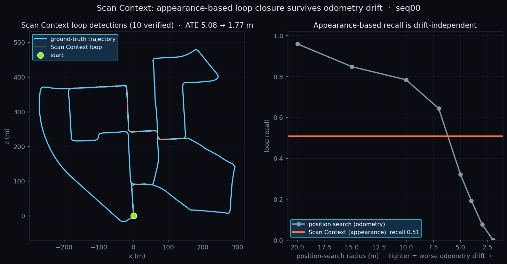
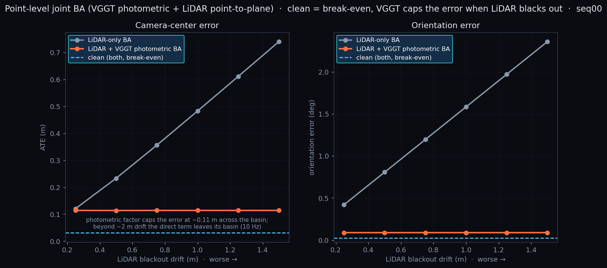

# 🛰️ 大场景 LiDAR SLAM · 定位 · 导航 · 感知

> 数公里真实城区（KITTI）上，从零手写的一整条自动驾驶感知-定位栈：一帧激光进来 → 稳定轨迹与地图、
> 厘米级定位、全局路径，再叠神经网络检测 / 跟踪 / 去动态。**纯 LiDAR、离线可复现、每块自研**，
> 只借 `numpy / scipy / open3d`，不碰任何非公开研究代码。

### ✨ 一眼亮点

| | |
| --- | --- |
| 🗺️ **完整栈自研** | 里程计 → 回环 → 位姿图 → 建图 → 定位 → 导航，一条龙跑通 |
| 🎯 **SLAM 精度 LOAM 量级** | 六序列平移误差均值 **0.82%**；seq00 回环后 ATE **4.85 → 2.25 m** |
| 🔄 **外观级回环抗漂移** | 自写 Scan Context：漂移下召回持平 **0.51**（位置法从 0.96 塌到 **0**），ATE **5.08 → 1.77 m** |
| 📍 **定位误差有界 5 cm** | 先验图 scan-to-map ICP，同段里程计已漂 7.7 m |
| 🚗 **从零手写 PointPillars** | 不碰 spconv/OpenPCDet，KITTI val Car BEV **AP@0.7 = 70.06** |
| ⚡ **从零 C++/Eigen ICP** | pybind11 + OpenMP，比 NumPy 快 **~8×**，与 Open3D 差 **0.1 mm** |
| 🔁 **感知反哺 SLAM** | 多目标跟踪判动/静 → 剔除动态点 → 干净静态地图 |
| 🌈 **VGGT 深度耦合** | 因子级→点级→联合 BA；里程计中断 ATE **11.18→0.51 m**、LiDAR 盲区误差平封 **0.11 m** |
| 🤖 **ROS2 在线化** | 自研栈封装成实时节点图，回放驱动 + RViz2 + `ros2 bag` |
| 🛰️ **跨传感器泛化** | KITTI 栈**零改动**跑 nuScenes（HDL-32E，32 线），10 场景 ATE 均值 **0.34 m** |
| ✅ **工程化** | 22 项单测 + GitHub Actions CI（含 C++ 扩展自动编译） |

---

## 🎬 效果一览

**实时演示（seq00）**：左固定全景边跑边建图，右跟车视角激光 + 手写 PointPillars 检测框 + 静/动航迹。


**五层金字塔**：① 轨迹 / ② 动态物体 / ③ 激光点云 / ④ LiDAR 稠密图 / ⑤ VGGT×LiDAR 稠密重建。


| | |
| --- | --- |
| 回环前后 vs 真值  | 六序列泛化  |
| 城区占据地图  | 俯视激光点云  |
| 先验图定位（误差有界） | 全局路径规划  |
| PointPillars 预测（绿）vs 真值（红） | 动态感知建图  |
| 外观级回环抗漂移（Scan Context） | VGGT 稠密重建融进 SLAM  |
| 相机 RGB 真彩 LiDAR 地图  | VGGT 因子接回中断轨迹  |
| 点级联合 BA（盲区平封 0.11 m） | VGGT 点补进 ICP（越稀越救命） |
| ROS2 实时节点图  | nuScenes 零改动泛化  |

---

## 🧩 全栈流水线

一帧激光扫描依次流过五个自研模块（seq00，4541 帧 / 3.7 km）：

| 阶段 | 做法 | 结果 |
| --- | --- | --- |
| ① 里程计 | scan-to-local-map 点面 ICP + 匀速先验 | 前 200 帧 ATE **0.22 m**、~30 ms/帧 |
| ② 回环 + 后端 | 近邻 / 外观检测 → ICP 收伪 → 位姿图优化 | 全程 ATE **4.85 → 2.25 m** |
| ③ 建图 | 3D 体素图 + 2D 占据栅格 | 310 万点，~600×600 m |
| ④ 定位 | 先验图 scan-to-map ICP | RMSE **0.05 m（有界）** |
| ⑤ 导航 | 占据图全局 A*（膨胀 + 可行驶走廊） | 起点→最远点 **650 m** |

**感知层**：手写 PointPillars 检测 → 卡尔曼多目标跟踪判动/静 → 剔除动态点得干净静态图。

---

## 🔬 亮点拆解

> 涉及 VGGT 的部分只调**公开模型 + 官方冻结权重**，融合 / 耦合逻辑全自研，绝不碰非公开研究代码。

### 🔄 外观级回环 · Scan Context（`kitti_slam/scan_context.py`）

自写极坐标最大高度指纹 + 旋转不变环键 + 列移不变距离。**按外观匹配、与里程计无关**：漂移时位置法漏检，它不受影响；SC 相对偏航还能当 ICP 验证初值（漂移下里程计初值把点云推到几公里外 fit=0，SC 偏航初值稳稳 fit=1.00）。

| 前端 | r=20m | r=10m | r=5m | r=2m | **Scan Context** |
| --- | --- | --- | --- | --- | --- |
| 召回 | 0.96 | 0.78 | 0.32 | **0.00** | **0.51（平线，precision 1.00）** |

端到端 ATE：里程计 **5.08 → 1.77 m**，优于位置法回环的 2.34 m。

### 🚗 手写 PointPillars 3D 检测（`det3d/`，纯 PyTorch）

不碰 spconv/OpenPCDet：点云切 pillar → 骨干 → 锚框头 → focal 损失 → 旋转框 IoU 分配 / NMS 全手写（4.81 M 参数）。走纯 2D 卷积也躲开在 5090 编译 spconv 的地狱。
> **KITTI val Car BEV AP（R40）：AP@0.5 = 80.46，AP@0.7 = 70.06。**

### ⚡ C++/Eigen 点面 ICP（`native/`，pybind11 + OpenMP）

Eigen 6-DOF 高斯牛顿 + nanoflann KD 树 + OpenMP，暴露成 `kitti_slam.icp_cpp`：

| 后端 | 耗时/帧 | 与 Open3D 位姿差 |
| --- | --- | --- |
| **自研 C++/Eigen** | **12.3 ms** | **0.1 mm** |
| 等价 NumPy | 101.5 ms | 0.1 mm |
| Open3D | 4.6 ms | (ref) |

### 🌈 VGGT 深度耦合（三步，逐步下沉到点级）

前馈视觉几何大模型 VGGT 的稠密重建融进 LiDAR SLAM。三步共同结论：**干净数据 ≈ 打平，主传感器退化时视觉几何兜底**。

**① 可视化级融合**（`run_vggt_fuse.py`）：每窗 Sim(3) 对齐 VGGT 相机轨迹 vs SLAM 相机轨迹，稠密点搬进世界系赋米制尺度，相机对齐 RMSE **6–20 cm**。另有相机 RGB 硬标定真彩地图（`run_color_map.py`，134 万点）。

**② 因子级 / 点级耦合**：

| 场景 | LiDAR-only | + VGGT |
| --- | --- | --- |
| 相对位姿因子进位姿图 · 干净 | 0.26 m | 0.30 m（≈打平） |
| 相对位姿因子进位姿图 · **里程计中断** | **11.18 m** | **0.51 m** |
| 稠密点补进 ICP · 激光抽到 245 点（0.2%） | 2.46° / 0.41 m | **0.47° / 0.09 m** |

**③ 点级联合 BA / 光度残差**（`run_vggt_ba.py`）：一个滑窗位姿放进同一最小二乘，光度残差（VGGT 深度反投影比灰度）+ 点面残差（LiDAR）同时优化，四层金字塔撑开直接法收敛域。

| 场景 | LiDAR-only BA | + VGGT 光度 BA |
| --- | --- | --- |
| 干净 | 0.036 m / 0.06° | 0.032 m / 0.03° |
| LiDAR 盲区漂移 0.2 m | 0.121 m / 0.42° | **0.114 m / 0.09°** |
| LiDAR 盲区漂移 1.5 m | **0.740 m / 2.36°** | **0.114 m / 0.09°** |

### 🤖 ROS2 在线化（`ros2_ws/`）

离线栈封装成实时计算图，数据集回放当虚拟传感器，算法全复用 `kitti_slam`：

| 节点 | 发布 |
| --- | --- |
| `cloud_player` / `nuscenes_player` | `/velodyne_points` |
| `odometry_node` | `/odom` + `/tf` + `/odom_path` |
| `mapping_node` | `/map` |
| `detection_node` | `/detections` |

一条 launch 起全图 + RViz2；实测 4 节点在线跑通，`ros2 bag` 录 370 消息 / 6 话题。

### 🛰️ 跨传感器泛化（nuScenes）

KITTI（HDL-64E）建的栈**一行参数不改**直接跑 nuScenes（**HDL-32E，32 线**，别家车队）——同一套 ROS2 图也只换数据源节点：

| 场景 | 里程 | ATE | 相对平移 |
| --- | --- | --- | --- |
| scene-0061 | 91 m | **0.07 m** | 0.79% |
| scene-1077 | 252 m | 0.55 m | 0.90% |
| **10 场景均值** | | **0.34 m** | **1.68%** |

---

## 📊 KITTI 六序列（官方相对误差）

| 序列 | 00 | 05 | 06 | 07 | 09 | 02 | 均值 |
| --- | --- | --- | --- | --- | --- | --- | --- |
| 平移误差 | 0.89% | 0.58% | 0.61% | 0.66% | 0.93% | 1.29% | **0.82%** |
| ATE (m) | 2.34 | 1.07 | 0.84 | 0.75 | 2.73 | 19.67 | 4.56 |

除 seq02（5 km 长途、高速段少回环、里程计漂移主导），其余五条 **0.58–0.93%**，落在经典 LOAM 精度带。

---

<details>
<summary>🚀 快速开始</summary>

```bash
PY=/media/4T/cst/envs/vggt-slam/bin/python3        # 只借 numpy/scipy/open3d

# SLAM → 定位 → 导航
$PY scripts/run_slam.py         --seq 0 --frames -1
$PY scripts/run_scan_context.py --seq 0            # 外观级回环
$PY scripts/run_mapping.py      --seq 0
$PY scripts/run_localize.py     --seq 0
$PY scripts/run_nav.py          --seq 0
$PY scripts/run_nuscenes.py     --all              # 跨传感器泛化

# 深度学习感知
$PY scripts/det3d_train.py   --epochs 20 --bs 6 --resume
$PY scripts/det3d_eval.py    --max-frames 1000 --score 0.1
$PY scripts/run_demo_anim.py --detector dl --frames 800

# 相机-LiDAR / VGGT 融合
$PY scripts/run_color_map.py   --seq 0 --stride 3
$PY scripts/run_vggt_fuse.py   --seq 0 --end 4541
$PY scripts/run_vggt_couple.py --seq 0 --gap 150,190
$PY scripts/run_vggt_icp.py    --seq 0 --fracs 0.03,0.005,0.002
$PY scripts/run_vggt_ba.py     --seq 0 --start 100 --count 8

# 自研 C++ ICP
bash native/fetch_deps.sh && bash native/build.sh
$PY scripts/bench_icp.py --seq 0 --frame 0
```
</details>

<details>
<summary>🗂️ 代码结构</summary>

```
kitti_slam/   odometry / loop / scan_context / posegraph / registration / mapping /
              localize / planning / tracking / metrics / kitti_io / nuscenes_io
det3d/        从零 PointPillars（体素化 / 骨干 / 锚框 / 损失 / 推理）
native/       C++/Eigen point-to-plane ICP（pybind11 → kitti_slam.icp_cpp）
ros2_ws/      ROS2 封装：cloud_player / nuscenes_player / odometry / mapping / detection
scripts/      各里程碑入口 + VGGT 深耦合 + 金字塔可视化
```
</details>

<details>
<summary>⚙️ 性能 · 测试 · 设计要点</summary>

- **性能**（单核 CPU + Open3D）：里程计 ~30 ms/帧 · 检测 ~21 ms/帧 · 定位 ~65 ms/帧；全序列里程计缓存 ~140 s、建图 ~112 s。
- **测试**：`pytest tests/` 22 项（合成数据，不依赖 KITTI/GPU）+ GitHub Actions CI 自动编译 C++ 扩展并跑测试。
- **坐标系**：里程计 velodyne 系（z 上）、KITTI 真值相机系（y 上），俯视图画 (x,z)；ATE 用 SE(3) 对齐。
- **定位用 ICP 非 MCL**：似然域 MCL 大场景朝向弱约束、发散百米；scan-to-map ICP 立到亚分米。
- **回环收伪**：ICP fitness ≥ 0.85 且 rmse ≤ 0.85 才接受，拒掉起点误匹配等伪回环。
</details>

---

## 🧭 路线图

- ☑ 全栈 SLAM：里程计 → 回环（位置法 + 外观级 Scan Context）→ 位姿图 → 建图 → 定位 → 导航
- ☑ 从零 PointPillars（AP@0.7 70.06）+ 多目标跟踪 + 动态点剔除建图
- ☑ 从零 C++/Eigen ICP（pybind11，快 ~8×）
- ☑ VGGT 深度耦合三步：可视化级 Sim(3) → 相对位姿因子进位姿图 → 点级联合 BA（只调公开冻结权重）
- ☑ ROS2 在线化 + 跨传感器泛化（nuScenes HDL-32E，10 场景 ATE 均值 0.34 m）
- ☐ 更大 / 多楼层场景（Newer College / Hilti，需子图 + 位姿图架构）
