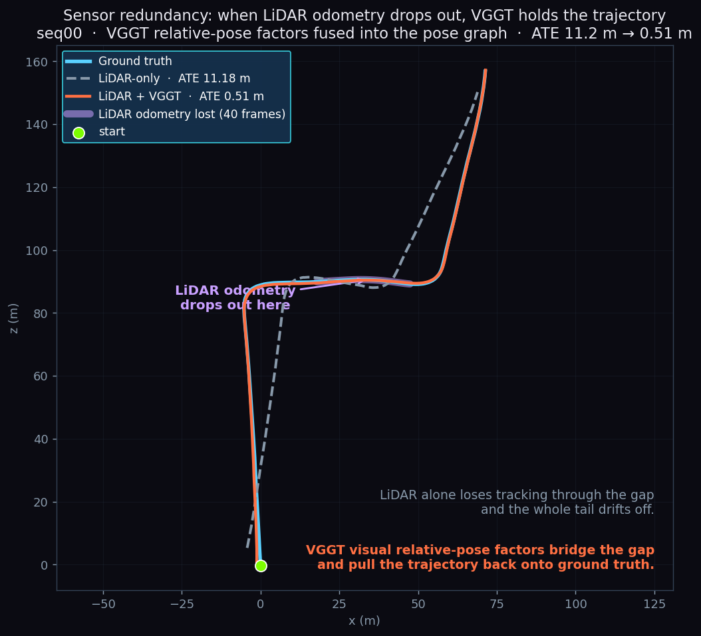
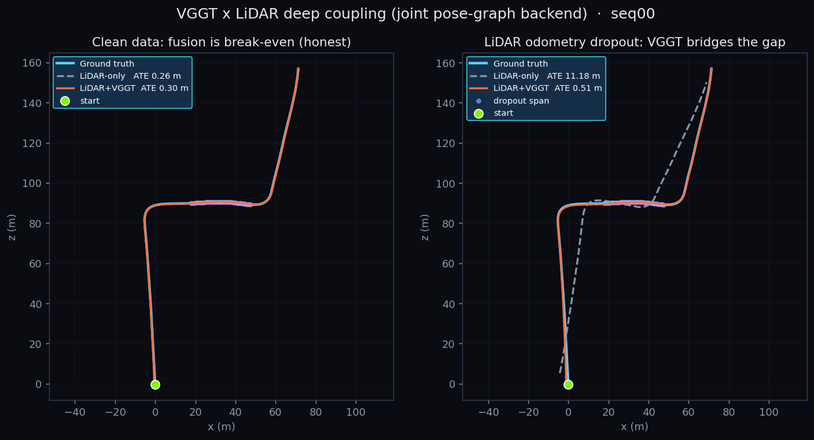
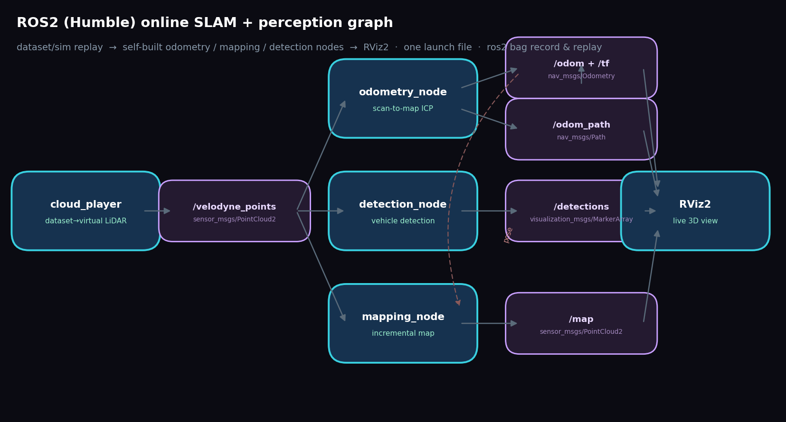
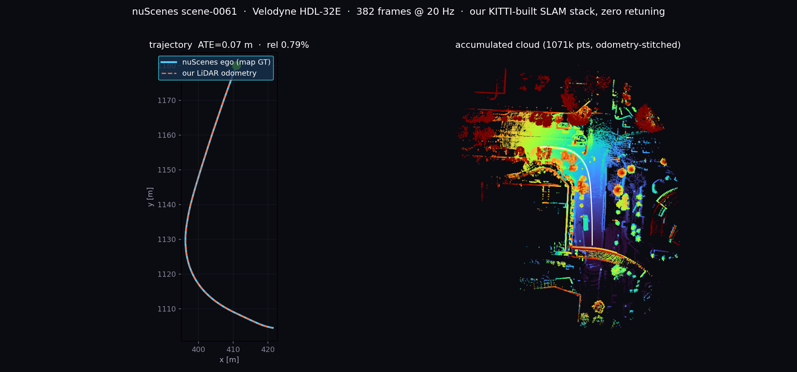
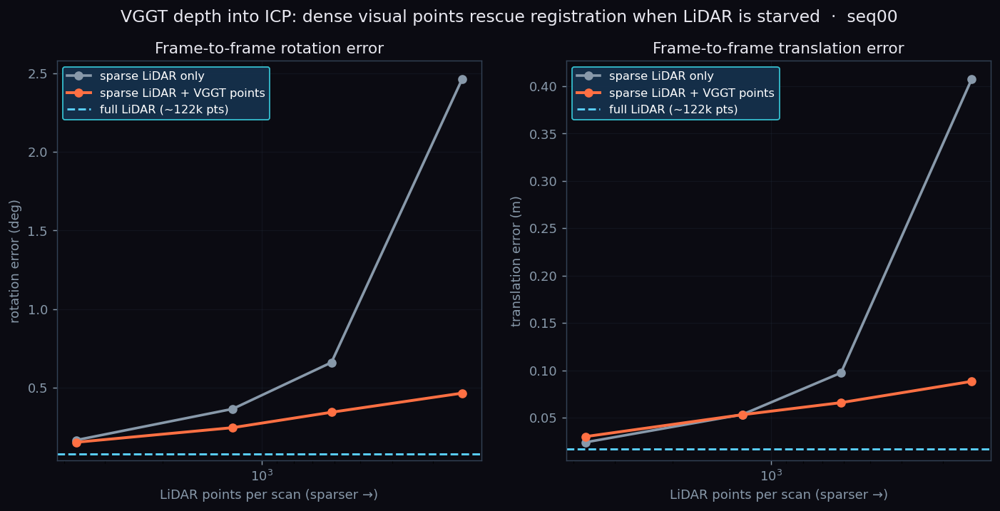

# 🛰️ 大场景 LiDAR SLAM · 定位 · 导航 · 感知


**我在数公里长的真实城区（KITTI）上，从零搭了一整条自动驾驶的感知-定位栈：**
一帧激光进来，就能输出稳定的轨迹和地图、厘米级的实时定位、一条能走的全局路径，
还有被神经网络检测、跟踪、再从地图里清掉的动态车辆。

纯 LiDAR、离线可复现、**每一块都自己写**——小到 ICP 内核，大到 PointPillars 检测器。
不依赖任何非公开的研究代码，只借标准库（`numpy / scipy / open3d`）做几何和优化。

---

### ✨ 一眼亮点

| | |
| --- | --- |
| 🗺️ **完整栈自研** | 里程计 → 回环 → 位姿图 → 建图 → 定位 → 导航，一条龙跑通 |
| 🎯 **SLAM 精度 LOAM 量级** | 多序列平移误差均值 **0.82%**；seq00 全程 3.7 km，回环后 ATE **4.85 → 2.25 m** |
| 📍 **定位误差有界 5 cm** | 先验图上 scan-to-map ICP，同段里程计已漂 7.7 m |
| 🚗 **从零手写 PointPillars** | 不碰 spconv/OpenPCDet，KITTI val Car BEV **AP@0.7 = 70.06** |
| ⚡ **从零 C++/Eigen ICP** | pybind11 + OpenMP，比等价 NumPy 快 **~8×**，与 Open3D 位姿差 **0.1 mm** |
| 🔁 **感知反哺 SLAM** | 多目标跟踪判动/静 → 剔除动态点 → 干净静态地图 |
| 🌈 **VGGT 深度耦合** | 稠密重建按 Sim(3) 融进世界系（相机对齐 **6–20 cm**）；相对位姿因子进位姿图，**里程计中断时 ATE 11.18→0.51 m** |
| 🤖 **ROS2 在线化** | 自研里程计/建图/检测封装成 ROS2 节点，回放驱动、TF/PointCloud2/MarkerArray、RViz2 + `ros2 bag` |
| 🛰️ **跨传感器泛化** | KITTI 建的栈**零改动**直接跑 nuScenes（Velodyne HDL-32E，32 线／别家车队），10 场景 ATE 均值 **0.34 m** |
| ✅ **工程化** | 19 项单测 + GitHub Actions CI（含 C++ 扩展自动编译） |

---

## 效果一览

**SLAM + 检测 + 跟踪 · 实时演示（seq00）**
左：固定全景，边跑边建图、画轨迹；右：跟车视角，激光扫描 + **手写 PointPillars 检测框** + 静/动航迹。
（检测器在 KITTI 3D-Object 上训练，直接搬到 Odometry 序列上跑——跨数据集也稳。）


**五层金字塔：从稠密像素到抽象轨迹**（① 轨迹 / ② 动态物体 / ③ 激光点云 / ④ LiDAR 稠密图 / ⑤ VGGT×LiDAR 稠密重建）


| | |
| --- | --- |
| 回环前后轨迹 vs 真值  | 六序列泛化  |
| 建出的城区占据地图  | 俯视激光点云（叠轨迹） |
| 先验图定位：误差有界 vs 里程计漂移  | 建图上全局路径规划  |
| PointPillars 预测（绿）vs 真值（红） | 动态感知建图（剔除移动车） |
| VGGT 稠密重建深度耦合进 SLAM 世界系（叠轨迹验证配准） | 相机 RGB 硬标定投影上色的真彩 LiDAR 地图  |
| **VGGT 因子进后端：LiDAR 里程计中断→视觉接回轨迹（ATE 11.18→0.51 m）**  | 干净 vs 中断双场景对比（干净打平、中断见价值） |

**ROS2 在线化：把整套栈跑成实时节点图**（数据集回放驱动，无需实车）


**跨传感器泛化：KITTI 上建的栈零改动直接跑 nuScenes（Velodyne HDL-32E，32 线）**
左：我们的 LiDAR 里程计（橙）vs nuScenes 地图定位真值（青），ATE 0.07 m；右：里程计拼出的路口点云。


---

## 🧩 这条流水线是怎么跑的

一帧激光扫描，依次流过五个自研模块：

| 阶段 | 一句话 | 结果（seq00，4541 帧 / 3.7 km） |
| --- | --- | --- |
| ① **里程计** | scan-to-local-map 点面 ICP + 匀速先验 | 前 200 帧 ATE **0.22 m** |
| ② **回环 + 后端** | 近邻检测→ICP 验证收伪；位姿图全局优化 | 全程 ATE **4.85 → 2.25 m** |
| ③ **建图** | 优化位姿拼 3D 体素图 + 2D 占据栅格 | 310 万点，~600×600 m 城区 |
| ④ **定位** | 先验地图上 scan-to-map ICP | RMSE **0.05 m（有界）** |
| ⑤ **导航** | 占据图上全局 A*（膨胀 + 可行驶走廊） | 起点→最远点 **650 m** 路径 |

之上再叠一层**感知**：手写 PointPillars 逐帧检测车辆 → 世界系卡尔曼多目标跟踪判动/静 →
把动态物体附近的点从地图里剔掉，得到干净的静态地图。检测既能当独立能力展示，也真正回馈了建图质量。

---

## 🔬 两块特意"自己造的轮子"

调库谁都会，所以有两处我特意从最底层写起——想证明这些核心算法我是真能落地的，不是只会 `import`：

### 手写 PointPillars 3D 检测器（`det3d/`，纯 PyTorch）

没用 spconv / OpenPCDet / mmdet3d，从点云怎么切成 pillar，到骨干网络、锚框头、focal 损失、
旋转框的 IoU 分配和 NMS——整条链路一行行敲出来（4.81 M 参数，RTX5090 上训了 20 个 epoch）。
走纯 2D 卷积这条路，也顺手躲开了在 5090 上编译 spconv 的地狱。

> **KITTI val Car BEV AP（R40）：AP@0.5 = 80.46，AP@0.7 = 70.06。** 自己从零训出来的单阶段检测器，跑到了 PointPillars 该有的水平。

### C++/Eigen 点面 ICP（`native/`，pybind11 + OpenMP）

从零写的 point-to-plane ICP：Eigen 做 6-DOF 高斯牛顿、nanoflann KD 树找对应、OpenMP 并行累加，
pybind11 暴露成 `kitti_slam.icp_cpp`。与 Open3D 同款线性化，位姿对齐到 **0.1 mm**。

| 后端 | 耗时/帧 | 与 Open3D 位姿差 |
| --- | --- | --- |
| **自研 C++/Eigen (OpenMP)** | **12.3 ms** | **0.1 mm** |
| 等价纯 NumPy | 101.5 ms | 0.1 mm |
| Open3D（成熟库） | 4.6 ms | (ref) |

即：**比等价 NumPy 快 ~8×**、位姿与成熟库一致，速度落在其 ~2.7× 以内。

---

## 🌈 把视觉大模型的稠密重建塞进 LiDAR 地图（`scripts/run_vggt_fuse.py`）

**VGGT** 是个前馈视觉几何大模型：喂它几张图，直接吐出稠密带色点云。麻烦在于它单目、没有真实尺度、
每个窗口还各说各话。我的 LiDAR SLAM 恰好反过来——尺度准、全局一致，就是点稀。那就把两边拼起来：

- 拿每个窗口里 VGGT 的相机轨迹去对齐 LiDAR SLAM 的相机轨迹（一次带尺度的相似变换）；
- 解出旋转、平移和尺度，把 VGGT 的稠密点搬进 SLAM 的世界系、赋上真实米制尺度；
- 一个窗口接一个窗口累积，就得到一张又稠、又带色、还带真实尺度的地图。

seq00 上每个窗口的相机对齐误差只有 **6–20 cm**，叠上 SLAM 轨迹一眼就能看出对得齐（金字塔第 ⑤ 层就是它）。

> 全程只用**公开的 VGGT 模型 + 官方权重**，绝不碰任何非公开的融合研究代码——拼接逻辑都是自己写的。
> 上面那张图是"可视化级"：靠相机位姿把稠密点锚进地图，VGGT 还没进估计。下面这步才让它真正进后端 ↓

### 更进一步：让 VGGT 真正改写轨迹（`scripts/run_vggt_couple.py`）

前面 VGGT 只负责"渲染"，不碰轨迹。这一步把它塞进**位姿图后端**：每个滑窗里 VGGT 吐出逐帧相对
相机运动，用 LiDAR 定出真实尺度、转到 velodyne 系，当成**相对位姿因子**和 LiDAR 里程计边、回环边
一起做全局优化——VGGT 从此真的会改动最终位姿。

诚实地说结论分两半（seq00 前 300 帧）：

| 场景 | LiDAR-only | LiDAR + VGGT |
| --- | --- | --- |
| **干净数据** | ATE 0.26 m | ATE 0.30 m（≈ 打平） |
| **里程计中断一段** | ATE **11.18 m**（断裂错位） | ATE **0.51 m**（接回来了） |


干净数据上纯 LiDAR 已经很强，加 VGGT 基本打平——这跟我之前试 IMU 紧耦合的结论一样，不藏着。
真正见价值的是**里程计中断**：我模拟一段 LiDAR 里程计丢失（该段没有里程计边、位姿冻结），LiDAR-only
的轨迹从此整段错位、ATE 冲到 11 m；而 VGGT 的视觉相对位姿因子把这段接回正确路径，ATE 拉回 0.5 m。
这就是耦合的意义——两个传感器互为冗余，激光断了视觉顶上。仍然只调公开 VGGT 权重，耦合逻辑全自己写。

### 再进一步：把 VGGT 深度补进 ICP（`scripts/run_vggt_icp.py`）

上面是位姿图**因子级**耦合，这一步下到**点级**：把 VGGT 每帧的稠密点（按窗口尺度转到 velodyne 系）
直接补进激光扫描，再做逐帧 point-to-plane ICP。同样先说诚实结论——**LiDAR 越稀，VGGT 越救命**：

| 每帧激光点数 | 旋转误差 sparse → +VGGT | 平移误差 sparse → +VGGT |
| --- | --- | --- |
| 3680（3%） | 0.166° → 0.152° | 0.024 → 0.030 m（打平/略负） |
| 613（0.5%） | 0.660° → 0.343° | 0.097 → 0.066 m |
| **245（0.2%）** | **2.46° → 0.47°**（−81%） | **0.41 → 0.09 m**（−78%） |



满 64 线（~12 万点）时 ICP 已经 0.077°/0.017 m，VGGT 点（median 0.46 m 噪）添不上忙、甚至略拖后腿；
可一旦把激光抽到只剩几百点（模拟极稀/廉价雷达），纯激光配准直接崩到 2.5°/0.4 m，而补进 VGGT 稠密点
稳稳拉回 0.47°/0.09 m。**跟里程计中断那个实验一个道理：主传感器一退化，视觉几何立刻兜底。**

**另一条路：直接拿相机给激光点上色**（`scripts/run_color_map.py`）——按 `P2·Tr` 标定把 KITTI 彩色
相机投到每帧激光点上、取像素颜色，再用 SLAM 位姿拼成一张 134 万点、覆盖全程 3.7 km 的真彩地图。
和 VGGT 各有所长：VGGT 会"脑补"出图像没拍到的地方，相机投影则是分毫不差的真实颜色（但只在相机视野内）。

---

## 🤖 ROS2 在线化（`ros2_ws/`）

把离线栈封装成**实时 ROS2 计算图**——用数据集/仿真回放当虚拟传感器,无需实车:

| 节点 | 订阅 → 发布 | 复用的算法 |
| --- | --- | --- |
| `cloud_player` | → `/velodyne_points` (PointCloud2) | 数据集回放成虚拟 LiDAR |
| `odometry_node` | `/velodyne_points` → `/odom` + `/tf` + `/odom_path` | 自研 scan-to-map 里程计 |
| `mapping_node` | `/velodyne_points`+`/odom` → `/map` | 增量体素建图 |
| `detection_node` | `/velodyne_points` → `/detections` (MarkerArray) | 几何车辆检测 |

一条 `launch` 起全图 + RViz2；`ros2 bag` 可录制回放。用的是标准 tf2 / sensor_msgs / nav_msgs /
vision_msgs 接口——**算法全复用工程里的 `kitti_slam` 模块,ROS2 只做在线封装**。

```bash
# RoboStack(conda,免 sudo)装 ROS2 Humble；把工程 numpy/scipy/open3d 装进该 env
conda create -n ros2 -c conda-forge -c robostack-staging python=3.11 ros-humble-desktop
cd ros2_ws && colcon build && source install/setup.bash
export KITTI_SLAM_ROOT=$(cd .. && pwd)
ros2 launch kitti_slam_ros slam_demo.launch.py seq:=0 rate:=10.0     # 一键起 + RViz2
```

> 实测:4 节点在线跑通,`/odom` 5 Hz、`/map` 增量增长、`/detections` 每帧出框,已用 `ros2 bag`
> 录下 370 条消息/6 话题验证。RViz2 是 GUI,headless 环境下以节点图 + `ros2 bag info` 佐证。

---

## 🛰️ 跨数据集 / 跨传感器泛化（nuScenes）

一套 SLAM 只在 KITTI 上刷分说明不了什么。把**在 KITTI（Velodyne HDL-64E，64 线）上搭好的整条栈**
**一行参数不改**，直接喂给 **nuScenes**（Motional 车队，**Velodyne HDL-32E，32 线**，20 Hz，波士顿/新加坡）——
点数只有 KITTI 的一半、扫描更稀，仍然稳：

| 场景 | 帧数 | 里程 | ATE (m) | 相对平移 |
| --- | --- | --- | --- | --- |
| scene-0061 | 382 | 91 m | **0.07** | 0.79% |
| scene-0655 | 396 | 163 m | 0.28 | 0.61% |
| scene-1077 | 400 | 252 m | 0.55 | 0.90% |
| scene-0796 | 392 | 236 m | 1.14 | 1.52% |
| **10 场景均值** | | | **0.34** | **1.68%**（8 个运动场景） |

> 误差比 KITTI（0.82%）略大很正常——32 线本来就更稀、城区车更多、真值自己也带噪声。但重点是：
> **换了家厂商的激光雷达、一个参数没调，照样跑到亚米级**，说明这套栈没有偷偷过拟合 KITTI。
> （`scripts/run_nuscenes.py`，不依赖官方 devkit，直接读 v1.0 json。）

同一套 **ROS2 在线图也照跑 nuScenes**——只换数据源节点，下游里程计/建图/检测节点原封不动：

```bash
ros2 launch kitti_slam_ros nuscenes_demo.launch.py scene:=0 rate:=10.0    # nuscenes_player → 同一套节点
```

---

## 🚀 快速开始

```bash
PY=/media/4T/cst/envs/vggt-slam/bin/python3     # 只借 numpy/scipy/open3d，不 import 任何研究模块

# —— SLAM → 定位 → 导航 ——
$PY scripts/run_slam.py     --seq 0 --frames -1   # 里程计 + 回环 + 位姿图（缓存位姿 & npz）
$PY scripts/run_mapping.py  --seq 0               # 建 3D/2D 地图
$PY scripts/run_localize.py --seq 0               # scan-to-map 先验图定位
$PY scripts/run_nav.py      --seq 0               # 全局路径规划
$PY scripts/run_nuscenes.py --all                 # 跨传感器泛化：整套栈直接跑 nuScenes(HDL-32E)

# —— 深度学习感知 ——
$PY scripts/det3d_train.py     --epochs 20 --bs 6 --resume        # 训 PointPillars
$PY scripts/det3d_eval.py      --max-frames 1000 --score 0.1      # val Car BEV AP
$PY scripts/run_demo_anim.py   --detector dl --frames 800         # 上面那张 demo GIF

# —— 相机-LiDAR 融合 ——
$PY scripts/run_color_map.py   --seq 0 --stride 3                 # 相机 RGB 硬标定投影 → 真彩 LiDAR 图
$PY scripts/run_vggt_fuse.py   --seq 0 --end 4541                 # VGGT 稠密重建融进 SLAM 世界系
$PY scripts/run_vggt_couple.py --seq 0 --gap 150,190             # VGGT 相对位姿因子进位姿图(里程计中断验证)
$PY scripts/run_vggt_icp.py    --seq 0 --fracs 0.03,0.005,0.002  # VGGT 稠密点补进 ICP(激光抽稀鲁棒性)
$PY scripts/plot_pyramid.py    --seq 0                            # 五层金字塔（⑤=VGGT×LiDAR）

# —— 自研 C++ ICP ——
bash native/fetch_deps.sh && bash native/build.sh                 # 编译扩展
$PY scripts/bench_icp.py --seq 0 --frame 0                        # 三后端对拍
```

---

## 📊 六条序列都跑了 —— 包括跑不好的那条

KITTI 官方相对误差（`scripts/eval_kitti.py`，真值只用来评测）：

| 序列 | 里程 | ATE (m) | 平移误差 | 旋转误差 |
| --- | --- | --- | --- | --- |
| 00 | 3737 m | 2.34 | 0.89% | 0.0042 |
| 05 | 2213 m | 1.07 | 0.58% | 0.0027 |
| 06 | 1237 m | 0.84 | 0.61% | 0.0028 |
| 07 | 698 m | 0.75 | 0.66% | 0.0050 |
| 09 | 1707 m | 2.73 | 0.93% | 0.0039 |
| 02 | 5080 m | 19.67 | 1.29% | 0.0044 |
| **均值** | | **4.56** | **0.82%** | **0.0038** |

除了 seq02，其余五条都在 **0.58–0.93%**，稳稳落在经典 LOAM 的精度带里。seq02 是块硬骨头——
5 km 长途、高速段几乎没有回环可用，误差主要来自里程计漂移，这点我没打算藏。我也没想去卷那些
被反复调优的 SOTA（比如 KISS-ICP ~0.5%），但一套从零写出来的栈能摸到经典方法的水平，够说明问题了。

<details>
<summary>性能 / 时延（本机实测，单核 CPU + Open3D）</summary>

- 里程计 ~30 ms/帧 · 检测（体素加速后）~21 ms/帧 · scan-to-map 定位 ~65 ms/帧
- 全序列（4541 帧）里程计缓存 ~140 s、建图 ~112 s
- 全局路径规划 <1 s；各类可视化秒级

</details>

<details>
<summary>测试 & CI</summary>

`pytest tests/`：19 项，覆盖评测 / 跟踪 / 规划 / 检测核 + C++ ICP 对拍，
用合成数据、不依赖 KITTI/GPU。GitHub Actions 每次 push 自动装依赖、**编译 C++ 扩展**并跑测试。

</details>

---

## 🗂️ 代码结构

```
kitti_slam/
  odometry.py      scan-to-local-map 里程计        loop.py / posegraph.py  回环 + 位姿图后端
  registration.py  点云预处理 & point-to-plane ICP  mapping.py    3D 体素图 + 2D 占据栅格
  localize.py      scan-to-map 先验图定位           planning.py   栅格 A* 全局规划
  tracking.py      世界系卡尔曼多目标跟踪（反哺去动态）  metrics.py   ATE + KITTI 官方相对误差
  kitti_io.py      KITTI Odometry 读取              nuscenes_io.py  nuScenes(HDL-32E) 读取(跨传感器泛化)
det3d/             从零 PointPillars（体素化 / 骨干 / 锚框 / 损失 / 推理）
native/            C++/Eigen point-to-plane ICP（pybind11 → kitti_slam.icp_cpp）
ros2_ws/           ROS2 封装：cloud_player / nuscenes_player / odometry / mapping / detection + launch
scripts/           各里程碑入口 + run_nuscenes（nuScenes 泛化）+ run_vggt_fuse（深度耦合）+ plot_pyramid
```

<details>
<summary>设计要点 / 踩过的坑</summary>

- **坐标系**：里程计在 velodyne 系（z 朝上）、KITTI 真值在相机系（y 竖直、水平面 x–z），
  比对与画俯视图务必分清；ATE 用 SE(3) 对齐，与坐标系无关。
- **定位为何用 ICP 而非 MCL**：先写了似然域 MCL，在大场景朝向弱约束、远点敏感，发散到百米级；
  换 scan-to-map ICP（配准固定地图，误差不随时间漂）立刻到亚分米。
- **回环收伪**：ICP fitness≥0.85 且 rmse≤0.85 才接受，正确拒掉起点误匹配等伪回环。
- **规划连通**：把行驶轨迹刻进代价图并加粗桥接，避免障碍膨胀误封窄街。

</details>

---

## 🧭 路线图

- ☑ 从零 PointPillars 3D 检测（AP@0.7 70.06）+ 多目标跟踪 + 动态点剔除建图
- ☑ 从零 C++/Eigen ICP（pybind11，快 ~8×）
- ☑ VGGT 前馈视觉大模型深度耦合（位姿锚定 Sim(3) 稠密融合 + VGGT 相对位姿因子进位姿图后端，里程计中断时 ATE 11.18→0.51 m；只调公开冻结权重）
- ☑ ROS2 在线化（自研栈封装成实时节点图，回放驱动 + RViz2 + ros2 bag）
- ☑ 跨传感器泛化：KITTI 建的栈零改动跑 nuScenes（Velodyne HDL-32E），10 场景 ATE 均值 0.34 m
- ☑ VGGT 因子级 + 点级深耦合：相对位姿因子进位姿图（里程计中断 ATE 11.18→0.51 m）、稠密点补进 ICP（激光抽到 245 点时旋转 2.46°→0.47°）
- ☐ 再往上做**点级联合 BA / 光度残差**（当前是点补进 ICP，尚非联合优化）
- ☐ 更大 / 多楼层场景（Newer College / Hilti，需子图 + 位姿图架构）
