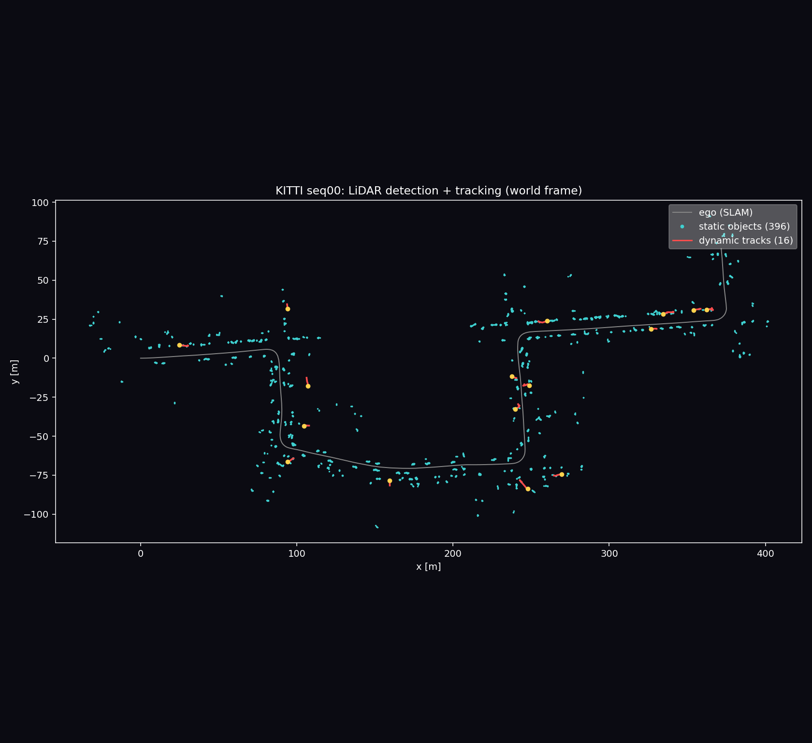
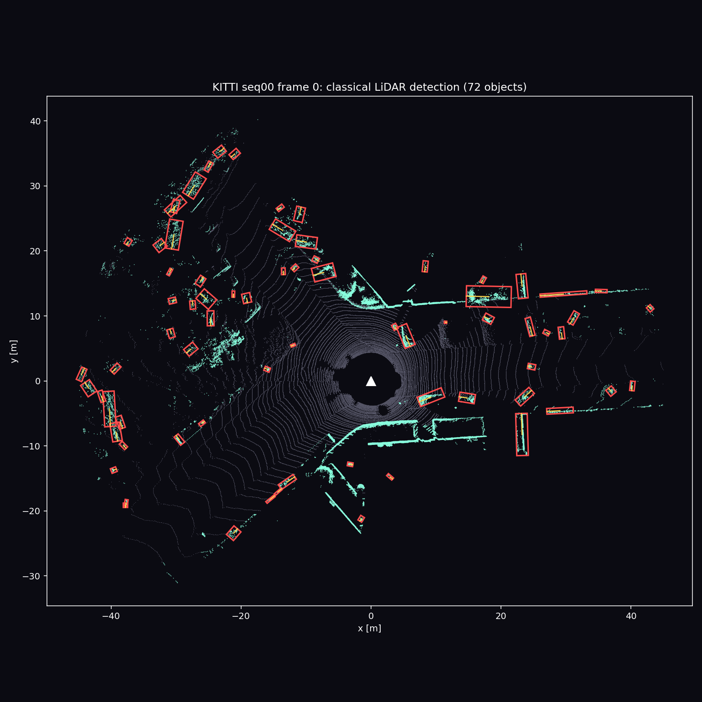
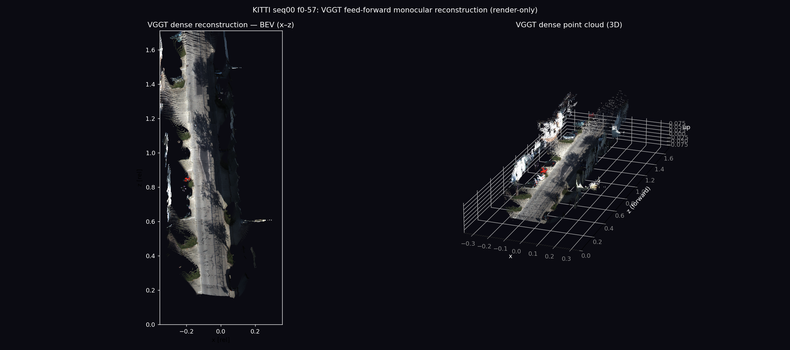

# KITTI 大场景 LiDAR SLAM · 定位 · 导航


真实大场景（KITTI Odometry，室外城区，单序列数公里）上的**稳定轨迹建图 + 定位 + 导航**
完整栈。纯 LiDAR、离线、可复现。全部自研，**不依赖任何非公开研究代码，暂不融合视觉**。

> 库依赖：`numpy / scipy / open3d`（Open3D 用于 ICP 配准与位姿图优化）。数据为公开的
> KITTI Odometry（velodyne 扫描 + 标定 + 真值位姿）。真值**仅用于评测**（declare→predict→evaluate）。

## 效果图 / Gallery

**系统输出分层金字塔**（轨迹 / 动态物体 / 激光点云 / 稠密建图）


**SLAM + 检测 + 跟踪 实时演示（seq00）**
左=固定全景（边跑边建图 + 轨迹），右=跟车（激光扫描 + 检测框 + 静/动航迹）。
检测器用**从零手写的 PointPillars**（在 KITTI 3D-Object 上训、直接在 Odometry seq00 上跑，跨数据集迁移）：


| | |
| --- | --- |
| 回环前后轨迹 vs 真值  | 多序列泛化  |
| 建出的 2D 占据地图 + 轨迹  | 俯视激光点云（叠轨迹） |
| 先验图定位：误差有界 vs 里程计漂移  | 建图上全局路径规划  |
| 检测 + 多目标跟踪（红=动/青=静） | 动态感知建图（剔除移动物） |
| 车辆检测（经典几何有向框） | VGGT 前馈稠密重建（仅渲染） |
| 手写 PointPillars 预测（绿）vs GT（红） | |

## 流水线与结果（KITTI seq00，4541 帧 / 3737 m）

| 阶段 | 方法 | 结果 |
| --- | --- | --- |
| ① 里程计 | scan-to-local-map point-to-plane ICP + 匀速先验 | 前 200 帧 ATE **0.22 m** |
| ② 回环+后端 | 位置近邻→ICP 验证回环；Open3D 位姿图全局优化(LM) | 全程 ATE **4.85 m → 2.25 m**（10 回环） |
| ③ 建图 | 优化位姿拼 3D 体素地图 + 高度带投影 2D 占据栅格 | 310 万点，~600×600 m 城区图 |
| ④ 定位 | 在先验地图上 scan-to-map ICP（里程计增量作初值） | RMSE **0.05 m（有界）** vs 里程计漂 7.7 m |
| ⑤ 导航 | 建图上全局 A*（障碍膨胀 + 可行驶走廊） | 起点→最远点规划 **650 m**（实际绕行 3737 m） |

产物在 `reports/`：`slam_seq00.png`（回环前后轨迹）、`map_seq00_bev.png` / `_3d.png`（建出的
2D/3D 地图）、`localize_seq00.png`（定位误差有界 vs 里程计漂移）、`nav_seq00.png`（路网规划）。

### KITTI 官方相对误差指标（多序列，`scripts/eval_kitti.py`）

平移误差（%，按 100–800m 子段）/ 旋转误差（deg/m），真值仅评测用：

| 序列 | 里程 | ATE(m) | t_err (%) | r_err (deg/m) |
| --- | --- | --- | --- | --- |
| 00 | 3737 | 2.34 | 0.89 | 0.0042 |
| 02 | 5080 | 19.67 | 1.29 | 0.0044 |
| 05 | 2213 | 1.07 | 0.58 | 0.0027 |
| 06 | 1237 | 0.84 | 0.61 | 0.0028 |
| 07 | 698 | 0.75 | 0.66 | 0.0050 |
| 09 | 1707 | 2.73 | 0.93 | 0.0039 |
| **mean** | | **4.56** | **0.82** | **0.0038** |

**定位参考**（各方法取自其论文/公开榜，同为 KITTI 训练序列、口径相近，**非严格同实验复现**）：
纯 LiDAR 里程计 SOTA 约 KISS-ICP ~0.5%、LOAM 系 ~0.7–0.9%。本工程从零实现的
scan-to-map + 回环 + 位姿图，除 seq02（长途少回环、里程计漂移主导，已知硬点）外
**~0.6–0.9%，处于 LOAM 量级**；不追求超越经过大量工程调优的 SOTA。

### 性能 / 时延（单核 CPU + Open3D，本机实测）

- 里程计 ~30 ms/帧；检测（体素加速后）~21 ms/帧；scan-to-map 定位 ~65 ms/帧；
  全序列（4541 帧）里程计缓存 ~140 s、建图 ~112 s。
- 全局路径规划 <1 s；BEV/点云/金字塔渲染秒级。

### 测试

`pytest tests/`（19 项，纯几何/评测/跟踪/规划/检测核 + C++ ICP 对拍，合成数据、不依赖 KITTI/GPU）；
GitHub Actions CI 每次 push 自动装依赖、**编译 C++ 扩展**并跑测试（见上方 badge）。

### C++/Eigen ICP 加速（`native/icp.cpp`，pybind11）

从零实现的 **point-to-plane ICP**（Eigen 做 6-DOF 高斯牛顿、nanoflann KD 树找对应、
OpenMP 并行累加），pybind11 暴露为 `kitti_slam.icp_cpp`。与 Open3D **同款线性化**，位姿对齐到 0.1 mm。

```bash
bash native/fetch_deps.sh   # 取 Eigen + nanoflann 到 third_party（或 apt install libeigen3-dev）
bash native/build.sh        # 编译出 kitti_slam/icp_cpp*.so
python scripts/bench_icp.py --seq 0 --frame 0   # 三后端对拍
```

KITTI seq00 相邻帧（~1 万点/帧，20 次平均）：

| 后端 | 耗时 (ms) | fitness | 与 Open3D 位姿差 |
| --- | --- | --- | --- |
| **C++/Eigen (OpenMP)** | **12.3** | 0.945 | **0.1 mm** |
| 纯 NumPy（同算法） | 101.5 | 0.945 | 0.1 mm |
| Open3D（成熟库，多线程） | 4.6 | 0.945 | (ref) |

即：自研 C++ 版**比等价 NumPy 快 ~8×**、与 Open3D 位姿一致，速度在成熟库 ~2.7× 以内——
证明能自己写核心算法并用 C++/OpenMP/pybind11 落地，而非仅调库。

### 从零手写 PointPillars 3D 检测（`det3d/`，纯 PyTorch）

不依赖 OpenPCDet / mmdet3d / spconv，**从零实现**整条 PointPillars 检测器并在 KITTI
3D-Object 上训练：点云 → pillar 体素化（9 维特征）→ PillarVFE → scatter 成伪图像 →
SECOND 2D 骨干 → SSD 单类锚框头；损失用 focal（分类）+ smooth-L1（回归）+ 方向分类，
锚框按 shapely 旋转 IoU 分配，推理走旋转 NMS + 方向消歧。4.81 M 参数，RTX5090 训 20 epoch。

KITTI val（3712/3769 官方 split，1000 帧，Car BEV AP，R40 插值）：

| 指标 | AP |
| --- | --- |
| **Car BEV AP@IoU 0.5** | **80.46** |
| **Car BEV AP@IoU 0.7** | **70.06** |

（未按 easy/mod/hard 分档、仅横向参考；AP@0.7 达 70 已是该架构的合理量级。）
预测框（绿，带分数）与 GT（红）对齐见 `reports/det3d_pred_*.png`。

```bash
$PY scripts/det3d_train.py --epochs 20 --bs 6 --resume   # 训练（ckpt 每 300 iter，抗中断）
$PY scripts/det3d_eval.py  --max-frames 1000 --score 0.1 # val Car BEV AP
$PY scripts/det3d_vis_pred.py --split val --nth 12 --score 0.4  # 预测可视化
$PY scripts/run_demo_anim.py --detector dl --frames 800         # SLAM+PointPillars+跟踪 demo GIF
```

> 检测/跟踪还反哺了 SLAM：世界系恒速卡尔曼多目标跟踪判静/动，把动态物体附近的扫描点从
> 建图中剔除，得到干净静态地图（`tracking.py` + `run_clean_map.py`）。

## 运行

```bash
PY=/media/4T/cst/envs/vggt-slam/bin/python3     # 仅借其 numpy/scipy/open3d，不 import 任何研究模块
$PY scripts/run_odometry.py --seq 0 --frames 200 --out reports/odom.png   # ① 里程计里程碑
$PY scripts/run_slam.py     --seq 0 --frames -1 --out reports/slam_seq00.png  # ②(缓存里程计位姿+SLAM npz)
$PY scripts/run_mapping.py  --seq 0     # ③ 建 3D/2D 地图
$PY scripts/run_localize.py --seq 0     # ④ scan-to-map 定位
$PY scripts/run_nav.py      --seq 0     # ⑤ 全局路径规划
```

## 模块

```
kitti_slam/
  kitti_io.py      读 velodyne/标定(Tr 取 official)/真值位姿/时间戳
  registration.py  点云裁剪+体素下采样+法线 & point-to-plane ICP（Open3D）
  odometry.py      LidarOdometry：scan-to-local-map 里程计
  loop.py          回环检测（位置近邻→ICP 验证收伪）
  posegraph.py     位姿图后端（Open3D 全局优化 LM）
  mapping.py       3D 体素地图 + 2D 占据栅格投影
  localize.py      MapLocalizer：scan-to-map ICP 先验地图定位
  planning.py      栅格 A* 全局规划（障碍膨胀 + 可行驶走廊）
  metrics.py       SE(3) 对齐 ATE + KITTI 官方相对误差（真值仅在此用）
  tracking.py      世界系恒速卡尔曼多目标跟踪（判静/动，反哺建图去动态）
det3d/             从零 PointPillars：kitti_det/voxelize/pointpillars/anchors/loss/dataset/infer
native/            C++/Eigen point-to-plane ICP（pybind11 → kitti_slam.icp_cpp）
```

## 设计要点 / 踩过的坑

- **坐标系**：里程计在 velodyne 系（z 朝上，水平面 x–y）；KITTI 真值在相机系（y 竖直，水平
  面 x–z），比对/画俯视图务必分清。ATE 用 SE(3) 对齐，与坐标系无关。
- **定位为何用 ICP 而非 MCL**：先实现了似然域 MCL 粒子滤波，在 KITTI 大场景朝向弱约束、远
  点敏感，会发散到百米级；换 **scan-to-map ICP**（配准固定地图，误差不随时间漂）立刻到亚分米。
- **回环收伪**：ICP fitness≥0.85 且 rmse≤0.85 才接受，正确拒掉起点误匹配等伪回环。
- **规划连通**：把行驶轨迹刻进代价图并加粗桥接，保证路网连通（膨胀可能误封窄街）。

## 路线图

- ☑ 从零 PointPillars 3D 检测（Car BEV AP@0.7 70.06）+ 多目标跟踪 + 动态点剔除建图。
- ☑ C++/Eigen point-to-plane ICP（pybind11，比 NumPy 快 ~8×）。
- ☐ 更大 / 多楼层数据集（Newer College / Hilti，需子图 + 位姿图架构）。
- ☐ 独立接入 VGGT 等前馈视觉模型作**视觉前端**（只调冻结权重，与 LiDAR 松耦合做消融）——
  独立实现，不复用任何非公开研究工程。
