# 🛰️ 大场景 LiDAR SLAM · 定位 · 导航 · 感知


**在数公里真实城区（KITTI）上，从零搭起一条完整的自动驾驶感知-定位栈：**
一帧激光进来，输出稳定的轨迹与地图、厘米级的实时定位、可行驶的全局路径，
以及被深度网络检测、跟踪、并从地图里剔除的动态车辆。

纯 LiDAR、离线可复现、**每一块都自己写**——从 ICP 内核到 PointPillars 检测器。
不依赖任何非公开研究代码，只借标准库（`numpy / scipy / open3d`）跑几何与优化。

---

### ✨ 一眼亮点

| | |
| --- | --- |
| 🗺️ **完整栈自研** | 里程计 → 回环 → 位姿图 → 建图 → 定位 → 导航，一条龙跑通 |
| 🎯 **SLAM 精度 LOAM 量级** | 多序列平移误差均值 **0.82%**；seq00 全程 3.7 km，回环后 ATE **4.85 → 2.25 m** |
| 📍 **定位误差有界 5 cm** | 先验图上 scan-to-map ICP，同段里程计已漂 7.7 m |
| 🚗 **从零手写 PointPillars** | 不碰 spconv/OpenPCDet，KITTI val Car BEV **AP@0.7 = 70.06** |
| ⚡ **从零 C++/Eigen ICP** | pybind11 + OpenMP，比等价 NumPy 快 **~8×**，与 Open3D 位姿差 **0.1 mm** |
| 🔁 **感知反哺 SLAM** | 多目标跟踪判动/静 → 剔除动态点 → 干净静态地图 |
| 🌈 **VGGT 深度耦合** | 前馈视觉大模型稠密重建按位姿 Sim(3) 融进 SLAM 世界系，相机对齐 **RMSE 6–20 cm** |
| ✅ **工程化** | 19 项单测 + GitHub Actions CI（含 C++ 扩展自动编译） |

---

## 效果一览

**SLAM + 检测 + 跟踪 · 实时演示（seq00）**
左：固定全景，边跑边建图、画轨迹；右：跟车视角，激光扫描 + **手写 PointPillars 检测框** + 静/动航迹。
（检测器在 KITTI 3D-Object 上训练，直接搬到 Odometry 序列上跑——跨数据集也稳。）

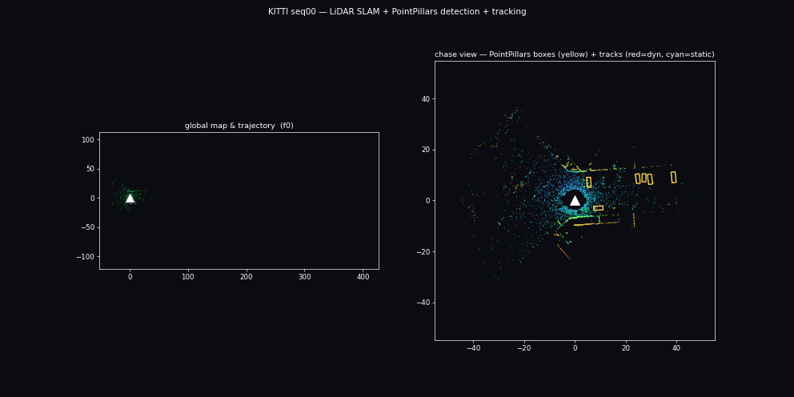

**五层金字塔：从稠密像素到抽象轨迹**（① 轨迹 / ② 动态物体 / ③ 激光点云 / ④ LiDAR 稠密图 / ⑤ VGGT×LiDAR 稠密重建）
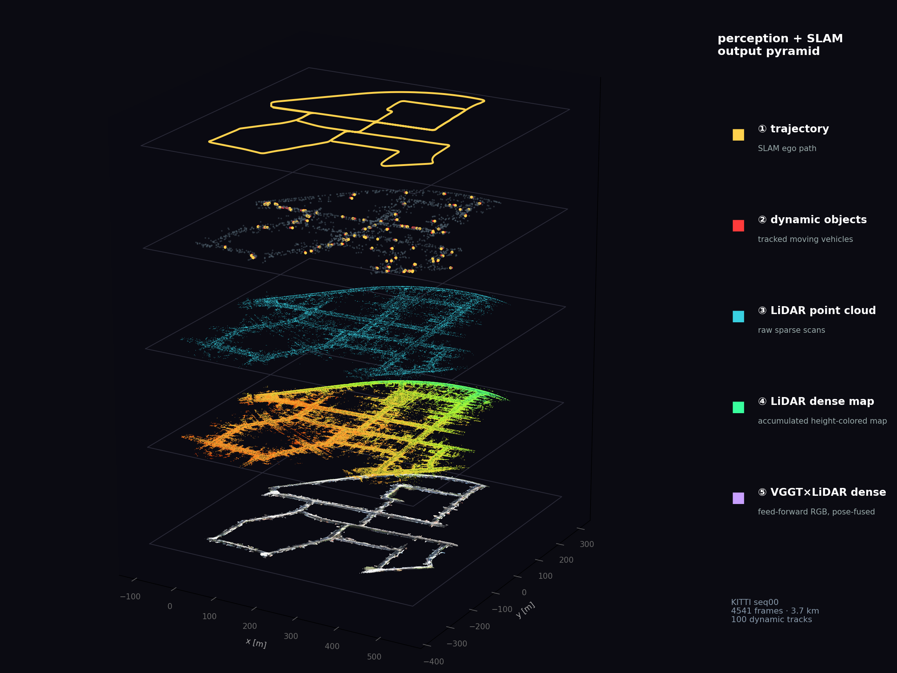

| | |
| --- | --- |
| 回环前后轨迹 vs 真值 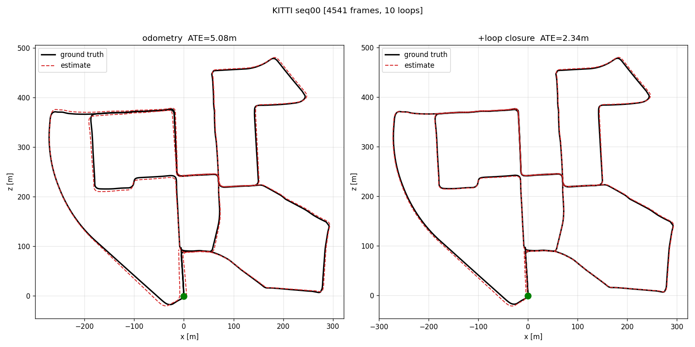 | 六序列泛化 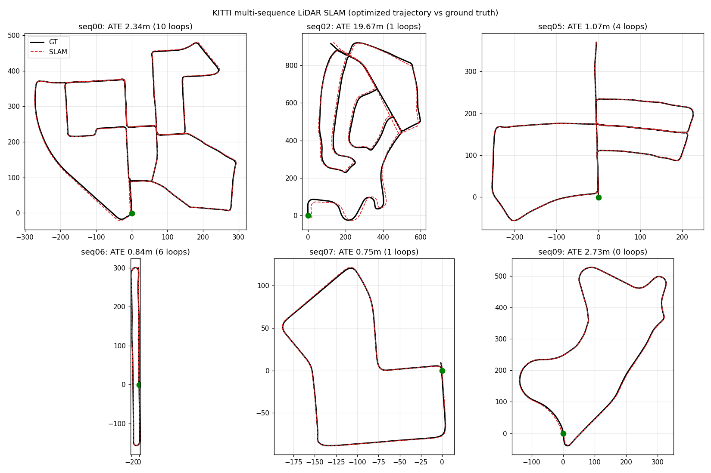 |
| 建出的城区占据地图 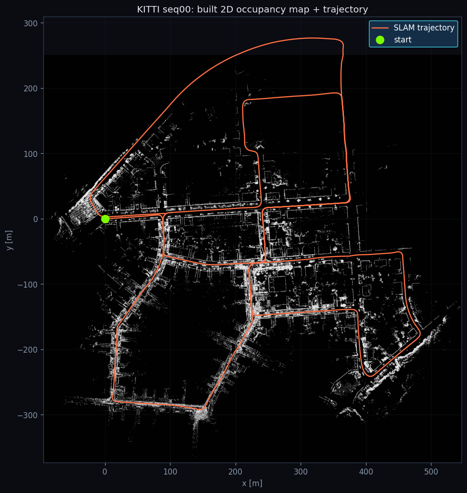 | 俯视激光点云（叠轨迹）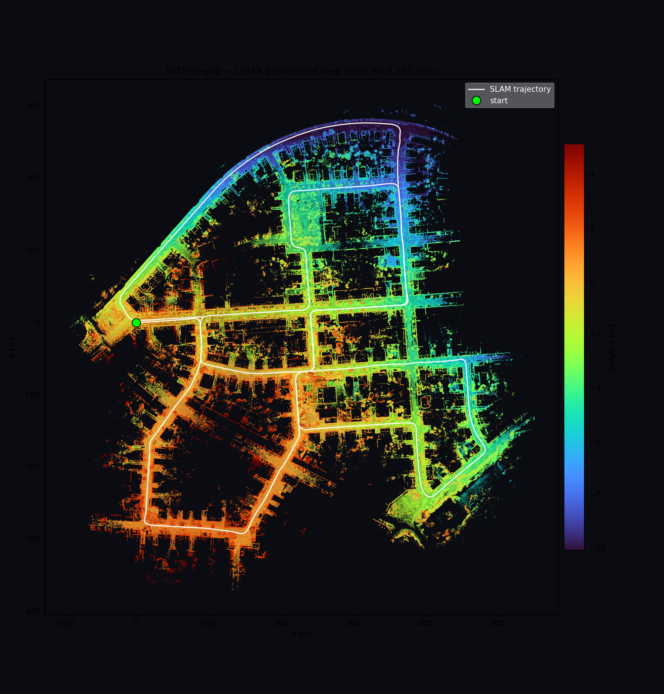 |
| 先验图定位：误差有界 vs 里程计漂移 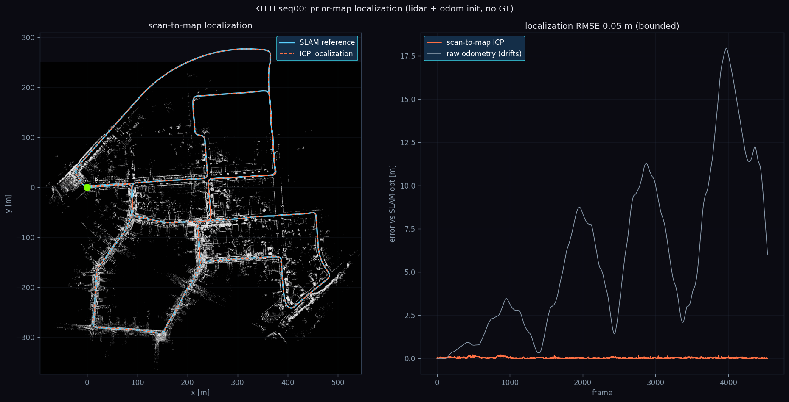 | 建图上全局路径规划 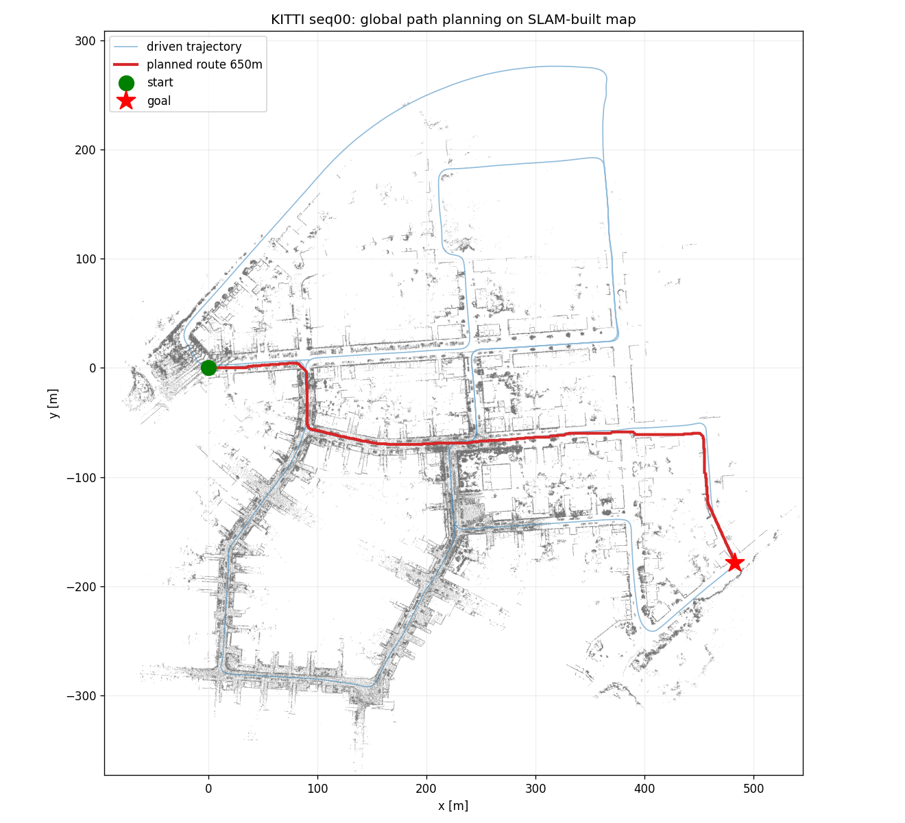 |
| PointPillars 预测（绿）vs 真值（红）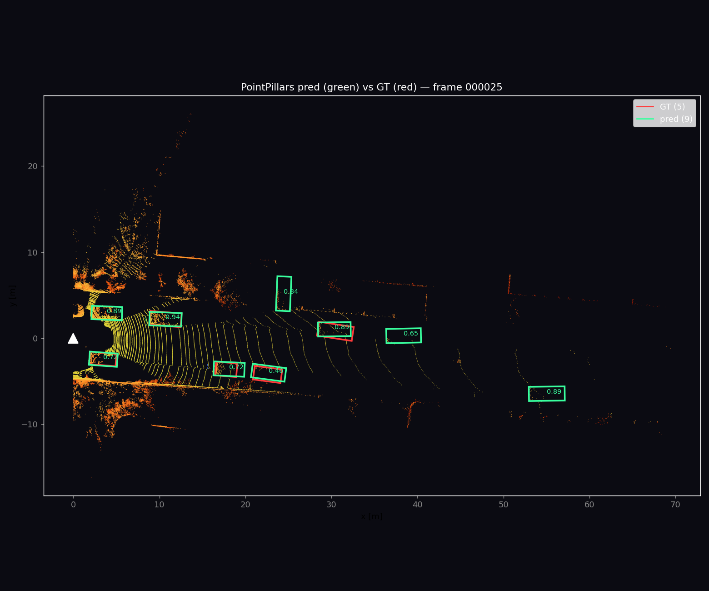 | 动态感知建图（剔除移动车）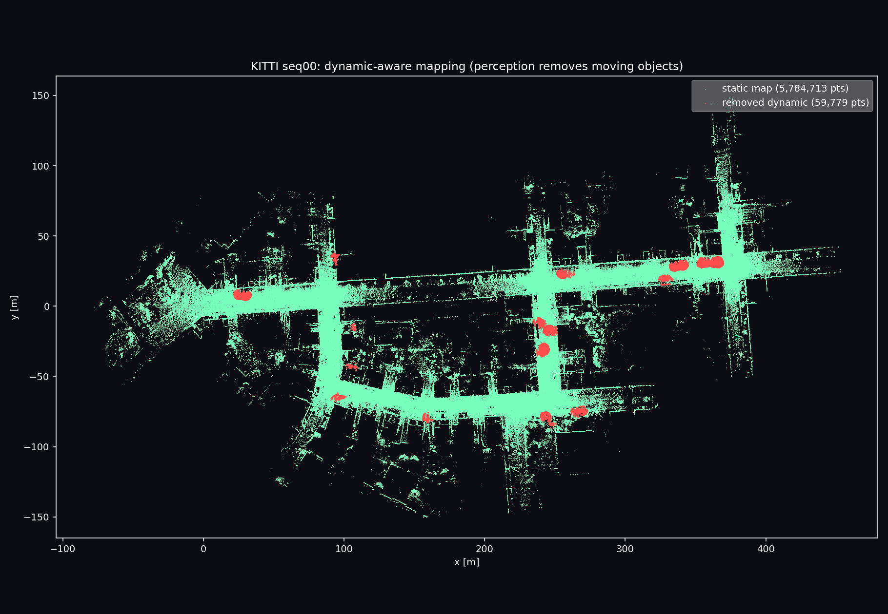 |
| VGGT 稠密重建深度耦合进 SLAM 世界系（叠轨迹验证配准）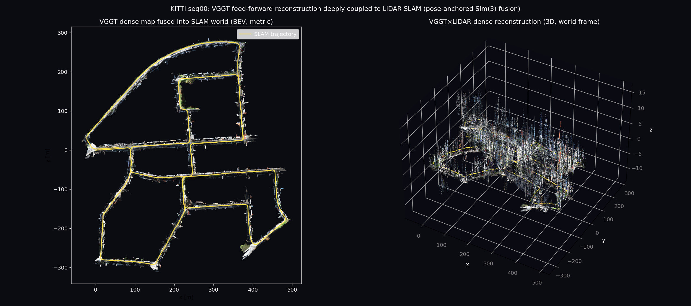 | 相机 RGB 硬标定投影上色的真彩 LiDAR 地图 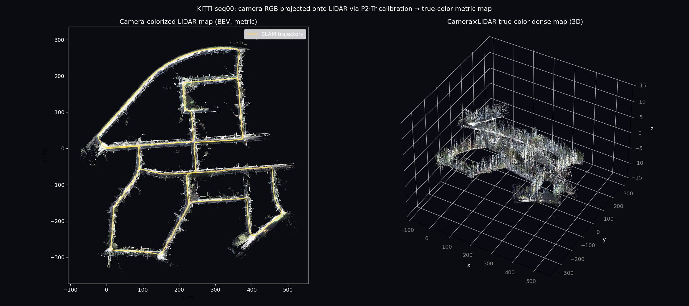 |

---

## 🧩 这条流水线是怎么跑的

一帧激光扫描，依次流过五个自研模块：

| 阶段 | 一句话 | 结果（seq00，4541 帧 / 3.7 km） |
| --- | --- | --- |
| ① **里程计** | scan-to-local-map 点面 ICP + 匀速先验 | 前 200 帧 ATE **0.22 m** |
| ② **回环 + 后端** | 近邻检测→ICP 验证收伪；位姿图全局优化 | 全程 ATE **4.85 → 2.25 m** |
| ③ **建图** | 优化位姿拼 3D 体素图 + 2D 占据栅格 | 310 万点，~600×600 m 城区 |
| ④ **定位** | 先验地图上 scan-to-map ICP | RMSE **0.05 m（有界）** |
| ⑤ **导航** | 占据图上全局 A*（膨胀 + 可行驶走廊） | 起点→最远点 **650 m** 路径 |

之上再叠一层**感知**：手写 PointPillars 逐帧检测车辆 → 世界系卡尔曼多目标跟踪判动/静 →
把动态物体附近的点从地图里剔掉，得到干净的静态地图。检测既能当独立能力展示，也真正回馈了建图质量。

---

## 🔬 两块"从零造轮子"

这个项目刻意不满足于调库。两处核心能力完全自己实现，用来证明能落地底层算法：

### 手写 PointPillars 3D 检测器（`det3d/`，纯 PyTorch）

绕开 spconv / OpenPCDet / mmdet3d，从点云体素化、PillarVFE、SECOND 骨干、SSD 锚框头，
到 focal 损失、旋转 IoU 分配、旋转 NMS + 方向消歧，**整条链路手写**（4.81 M 参数，
RTX5090 训 20 epoch）。选纯 2D 卷积路线也顺带避开了 5090 上编译 spconv 的地狱。

> **KITTI val Car BEV AP（R40）：AP@0.5 = 80.46，AP@0.7 = 70.06** —— 该架构的合理量级。

### C++/Eigen 点面 ICP（`native/`，pybind11 + OpenMP）

从零写的 point-to-plane ICP：Eigen 做 6-DOF 高斯牛顿、nanoflann KD 树找对应、OpenMP 并行累加，
pybind11 暴露成 `kitti_slam.icp_cpp`。与 Open3D 同款线性化，位姿对齐到 **0.1 mm**。

| 后端 | 耗时/帧 | 与 Open3D 位姿差 |
| --- | --- | --- |
| **自研 C++/Eigen (OpenMP)** | **12.3 ms** | **0.1 mm** |
| 等价纯 NumPy | 101.5 ms | 0.1 mm |
| Open3D（成熟库） | 4.6 ms | (ref) |

即：**比等价 NumPy 快 ~8×**、位姿与成熟库一致，速度落在其 ~2.7× 以内。

---

## 🌈 VGGT 视觉大模型深度耦合（`scripts/run_vggt_fuse.py`）

把前馈视觉几何大模型 **VGGT** 的稠密重建，真正**融进** LiDAR SLAM 的世界系——不是并排渲染：

- VGGT 每个窗口前馈出稠密带色点云 + 相机位姿，但**单目、尺度任意、各窗口独立**；
- LiDAR SLAM 给出**全局一致的度量位姿**（含回环 + 位姿图）；
- 对每个窗口，用 VGGT 相机中心 vs SLAM 相机中心做 **含尺度的 Sim(3)（Umeyama）对齐**，
  把稠密点旋进 SLAM 世界系并赋予真实米制尺度；多窗口累积 + 体素下采样成全局稠密带色地图。

即 **LiDAR 定尺度与全局约束、VGGT 供稠密光度几何**，经相机位姿耦合。seq00 各窗口相机对齐
**RMSE 仅 6–20 cm**，叠上 SLAM 轨迹即可肉眼验证配准（见效果图与金字塔第 ⑤ 层）。

> 只调**公开 VGGT 模型 + 官方权重**，**绝不导入任何非公开的融合研究工程**——耦合逻辑全为独立实现。
> 这是位姿锚定的稠密融合，非联合 BA；诚实定位为"可视化级深度耦合"。

**对照：相机-LiDAR 硬标定上色**（`scripts/run_color_map.py`）——把 KITTI 彩色相机按 `P2·Tr`
标定投影到每帧激光点、取像素 RGB 上色，再用 SLAM 位姿累积成**度量精确的真彩地图**（134 万点覆盖
全 3.7 km 回环）。与 VGGT 各有侧重：VGGT 供**学习式稠密补全**（含图像未覆盖处），相机投影供
**几何精确的真实颜色**（仅相机视野、无尺度歧义）。两条相机-LiDAR 融合路线都自己实现。

---

## 🚀 快速开始

```bash
PY=/media/4T/cst/envs/vggt-slam/bin/python3     # 只借 numpy/scipy/open3d，不 import 任何研究模块

# —— SLAM → 定位 → 导航 ——
$PY scripts/run_slam.py     --seq 0 --frames -1   # 里程计 + 回环 + 位姿图（缓存位姿 & npz）
$PY scripts/run_mapping.py  --seq 0               # 建 3D/2D 地图
$PY scripts/run_localize.py --seq 0               # scan-to-map 先验图定位
$PY scripts/run_nav.py      --seq 0               # 全局路径规划

# —— 深度学习感知 ——
$PY scripts/det3d_train.py     --epochs 20 --bs 6 --resume        # 训 PointPillars
$PY scripts/det3d_eval.py      --max-frames 1000 --score 0.1      # val Car BEV AP
$PY scripts/run_demo_anim.py   --detector dl --frames 800         # 上面那张 demo GIF

# —— 相机-LiDAR 融合 ——
$PY scripts/run_color_map.py   --seq 0 --stride 3                 # 相机 RGB 硬标定投影 → 真彩 LiDAR 图
$PY scripts/run_vggt_fuse.py   --seq 0 --end 4541                 # VGGT 稠密重建融进 SLAM 世界系
$PY scripts/plot_pyramid.py    --seq 0                            # 五层金字塔（⑤=VGGT×LiDAR）

# —— 自研 C++ ICP ——
bash native/fetch_deps.sh && bash native/build.sh                 # 编译扩展
$PY scripts/bench_icp.py --seq 0 --frame 0                        # 三后端对拍
```

---

## 📊 多序列泛化 & 诚实的边界

KITTI 官方相对误差（`scripts/eval_kitti.py`，真值仅评测用）：

| 序列 | 里程 | ATE (m) | 平移误差 | 旋转误差 |
| --- | --- | --- | --- | --- |
| 00 | 3737 m | 2.34 | 0.89% | 0.0042 |
| 05 | 2213 m | 1.07 | 0.58% | 0.0027 |
| 06 | 1237 m | 0.84 | 0.61% | 0.0028 |
| 07 | 698 m | 0.75 | 0.66% | 0.0050 |
| 09 | 1707 m | 2.73 | 0.93% | 0.0039 |
| 02 | 5080 m | 19.67 | 1.29% | 0.0044 |
| **均值** | | **4.56** | **0.82%** | **0.0038** |

除 seq02（5 km 长途、高速段少回环、里程计漂移主导——已知硬点）外，
其余序列 **0.58–0.93%，稳定处于 LOAM 量级**。不追求超越经大量工程调优的 SOTA（KISS-ICP ~0.5%），
但从零实现的栈能达到经典方法的精度带。

<details>
<summary>性能 / 时延（本机实测，单核 CPU + Open3D）</summary>

- 里程计 ~30 ms/帧 · 检测（体素加速后）~21 ms/帧 · scan-to-map 定位 ~65 ms/帧
- 全序列（4541 帧）里程计缓存 ~140 s、建图 ~112 s
- 全局路径规划 <1 s；各类可视化秒级

</details>

<details>
<summary>测试 & CI</summary>

`pytest tests/`：19 项，覆盖评测 / 跟踪 / 规划 / 检测核 + C++ ICP 对拍，
用合成数据、不依赖 KITTI/GPU。GitHub Actions 每次 push 自动装依赖、**编译 C++ 扩展**并跑测试。

</details>

---

## 🗂️ 代码结构

```
kitti_slam/
  odometry.py      scan-to-local-map 里程计        loop.py / posegraph.py  回环 + 位姿图后端
  registration.py  点云预处理 & point-to-plane ICP  mapping.py    3D 体素图 + 2D 占据栅格
  localize.py      scan-to-map 先验图定位           planning.py   栅格 A* 全局规划
  tracking.py      世界系卡尔曼多目标跟踪（反哺去动态）  metrics.py   ATE + KITTI 官方相对误差
det3d/             从零 PointPillars（体素化 / 骨干 / 锚框 / 损失 / 推理）
native/            C++/Eigen point-to-plane ICP（pybind11 → kitti_slam.icp_cpp）
scripts/           各里程碑入口 + run_vggt_fuse（VGGT×LiDAR 深度耦合）+ plot_pyramid（五层图）
```

<details>
<summary>设计要点 / 踩过的坑</summary>

- **坐标系**：里程计在 velodyne 系（z 朝上）、KITTI 真值在相机系（y 竖直、水平面 x–z），
  比对与画俯视图务必分清；ATE 用 SE(3) 对齐，与坐标系无关。
- **定位为何用 ICP 而非 MCL**：先写了似然域 MCL，在大场景朝向弱约束、远点敏感，发散到百米级；
  换 scan-to-map ICP（配准固定地图，误差不随时间漂）立刻到亚分米。
- **回环收伪**：ICP fitness≥0.85 且 rmse≤0.85 才接受，正确拒掉起点误匹配等伪回环。
- **规划连通**：把行驶轨迹刻进代价图并加粗桥接，避免障碍膨胀误封窄街。

</details>

---

## 🧭 路线图

- ☑ 从零 PointPillars 3D 检测（AP@0.7 70.06）+ 多目标跟踪 + 动态点剔除建图
- ☑ 从零 C++/Eigen ICP（pybind11，快 ~8×）
- ☑ VGGT 前馈视觉大模型深度耦合（位姿锚定 Sim(3) 稠密融合，只调公开冻结权重）
- ☐ 把 VGGT 稠密融合升级为联合 BA / 深度约束进 ICP（当前为可视化级耦合）
- ☐ 更大 / 多楼层场景（Newer College / Hilti，需子图 + 位姿图架构）
